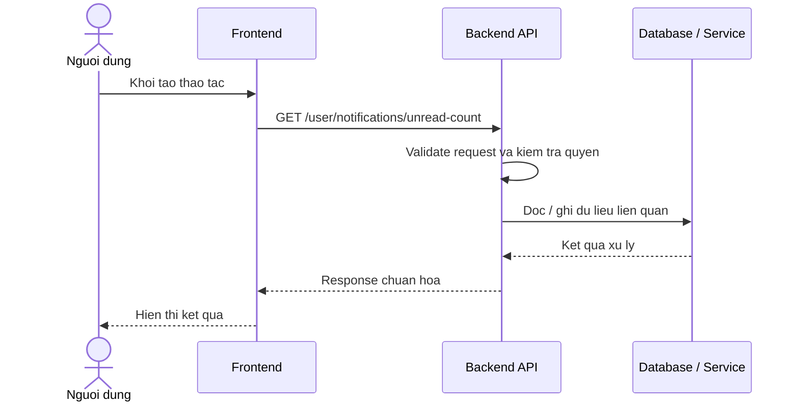

# Software Requirement Specification (SRS)
## Chuc nang: Lay so luong thong bao chua doc

### Mermaid Sequence Diagram

**Ma chuc nang:** NOTIFICATION-UNREAD-COUNT-01  
**Trang thai:** Draft / Review  
**Nguoi soan thao:** Nhu Trung Hai  
**Vai tro:** Technical Writer / Developer

---

### 1. Mo ta tong quan (Description)
Chuc nang tra ve tong so thong bao chua doc de frontend hien thi badge realtime hoac khi tai trang. API hien tai duoc trien khai tai `GET /user/notifications/unread-count`.

### 2. Luong nghiep vu (User Workflow)
| Buoc | Hanh dong nguoi dung | Phan hoi he thong |
| :--- | :--- | :--- |
| 1 | Nguoi dung / quan tri vien mo chuc nang tuong ung | Frontend chuan bi du lieu va goi API. |
| 2 | Frontend gui request den backend | Backend kiem tra du lieu dau vao, token, quyen va ngu canh nghiep vu. |
| 3 | Backend xu ly nghiep vu | He thong doc / ghi du lieu tai MongoDB hoac dich vu phu tro. |
| 4 | Hoan tat | Backend tra response dang `status`, `message`, `data` de frontend cap nhat giao dien. |

### 3. Yeu cau du lieu (Data Requirements)
#### 3.1. Du lieu dau vao (Input Fields)
* Header `Authorization` hop le.

#### 3.2. Du lieu dau ra (Response Data)
* `data.unreadCount` hoac truong tuong duong the hien tong so thong bao chua doc.

#### 3.3. Du lieu luu tru / truy xuat
* Collection `notifications` de dem cac ban ghi `is_read = false` cua user.

### 4. Rang buoc ky thuat & bao mat (Technical Constraints)
* Chi dem tren pham vi user hien tai.
* API can nhe de co the goi nhieu lan tu giao dien.

### 5. Truong hop ngoai le & xu ly loi (Edge Cases)
* **Truong hop:** User chua co thong bao chua doc.  
  * **Xu ly:** Tra `0`.
* **Truong hop:** Token het han.  
  * **Xu ly:** Tra `401 Unauthorized`.

### 6. Giao dien (UI/UX)
* Badge so thong bao nen cap nhat theo gia tri API tra ve.
* Khong nen chan giao dien neu API dem that bai.

---
