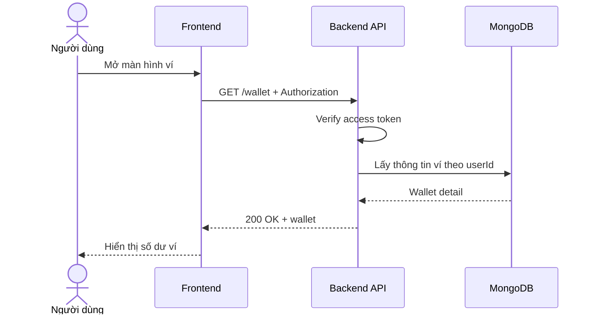

# Software Requirement Specification (SRS)
## Chức năng: Xem ví người dùng (Get Wallet)

### Mermaid Sequence Diagram

**Mã chức năng:** WALLET-GET-01  
**Trạng thái:** Draft / Review  
**Người soạn thảo:** Nguyễn Trọng An  
**Vai trò:** Technical Writer / Developer

---

### 1. Mô tả tổng quan (Description)
Chức năng xem ví người dùng cho phép lấy thông tin số dư và dữ liệu ví hiện tại của tài khoản đăng nhập. API hiện tại được triển khai tại `GET /wallet`.

### 2. Luồng nghiệp vụ (User Workflow)
| Bước | Hành động người dùng | Phản hồi hệ thống |
| :--- | :--- | :--- |
| 1 | Người dùng mở màn hình ví | Frontend gọi API thông tin ví. |
| 2 | Backend xác thực người dùng | Kiểm tra token. |
| 3 | Backend truy vấn wallet | Lấy ví hiện tại theo `userId`. |
| 4 | Hoàn tất | Trả dữ liệu ví. |

### 3. Yêu cầu dữ liệu (Data Requirements)
#### 3.1. Dữ liệu đầu vào (Input Fields)
* **Authorization:** bắt buộc.

#### 3.2. Dữ liệu đầu ra (Response Data)
* `status`
* `data`: wallet detail

#### 3.3. Dữ liệu lưu trữ / truy xuất
* Wallet của user hiện tại

### 4. Ràng buộc kỹ thuật & bảo mật (Technical Constraints)
* Route yêu cầu đăng nhập.

### 5. Trường hợp ngoại lệ & xử lý lỗi (Edge Cases)
* **Trường hợp:** Không đăng nhập.  
  * **Xử lý:** Trả `401 Unauthorized`.

### 6. Giao diện (UI/UX)
* Nên hiển thị số dư và các hành động nạp tiền / lịch sử giao dịch.

---
