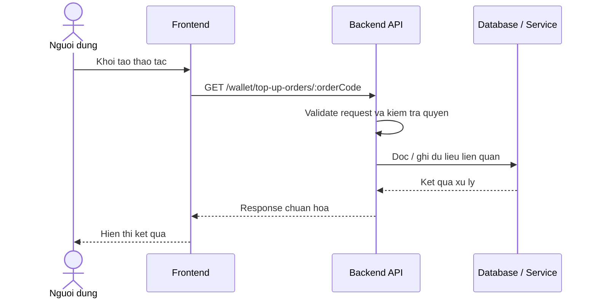

# Software Requirement Specification (SRS)
## Chuc nang: Xem chi tiet lenh nap tien vi

### Mermaid Sequence Diagram

**Ma chuc nang:** WALLET-TOPUP-ORDER-DETAIL-01  
**Trang thai:** Draft / Review  
**Nguoi soan thao:** Nhu Trung Hai  
**Vai tro:** Technical Writer / Developer

---

### 1. Mo ta tong quan (Description)
Chuc nang tra ve trang thai chi tiet cua mot lenh top-up de nguoi dung kiem tra viec thanh toan da duoc ghi nhan hay chua. API hien tai duoc trien khai tai `GET /wallet/top-up-orders/:orderCode`.

### 2. Luong nghiep vu (User Workflow)
| Buoc | Hanh dong nguoi dung | Phan hoi he thong |
| :--- | :--- | :--- |
| 1 | Nguoi dung / quan tri vien mo chuc nang tuong ung | Frontend chuan bi du lieu va goi API. |
| 2 | Frontend gui request den backend | Backend kiem tra du lieu dau vao, token, quyen va ngu canh nghiep vu. |
| 3 | Backend xu ly nghiep vu | He thong doc / ghi du lieu tai MongoDB hoac dich vu phu tro. |
| 4 | Hoan tat | Backend tra response dang `status`, `message`, `data` de frontend cap nhat giao dien. |

### 3. Yeu cau du lieu (Data Requirements)
#### 3.1. Du lieu dau vao (Input Fields)
* Header `Authorization` hop le.
* Path param `orderCode` hop le.

#### 3.2. Du lieu dau ra (Response Data)
* Chi tiet lenh nap tien, so tien, trang thai, thoi diem tao va cap nhat.

#### 3.3. Du lieu luu tru / truy xuat
* Collection `wallet_topup_orders` de tra cuu don nap vi.

### 4. Rang buoc ky thuat & bao mat (Technical Constraints)
* Nguoi dung chi xem duoc order cua chinh minh.
* Ma order phai duoc validate truoc khi truy van.

### 5. Truong hop ngoai le & xu ly loi (Edge Cases)
* **Truong hop:** Order khong ton tai.  
  * **Xu ly:** Tra `404`.
* **Truong hop:** Order thuoc user khac.  
  * **Xu ly:** Tra loi phan quyen.

### 6. Giao dien (UI/UX)
* Trang chi tiet order nen refresh trang thai dinh ky hoac co nut kiem tra lai.
* Nen hien thi ro pending / paid / failed.

---
