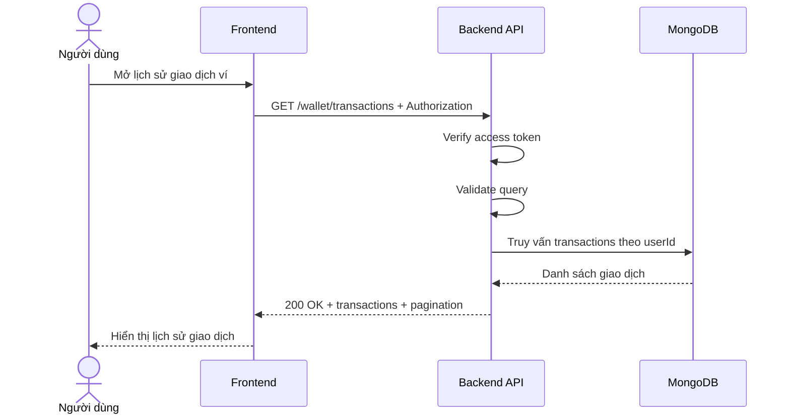

# Software Requirement Specification (SRS)
## Chức năng: Xem lịch sử giao dịch ví (Get Wallet Transactions)

### Mermaid Sequence Diagram

**Mã chức năng:** WALLET-TRANSACTIONS-01  
**Trạng thái:** Draft / Review  
**Người soạn thảo:** Phạm Nguyễn Hưng  
**Vai trò:** Technical Writer / Developer

---

### 1. Mô tả tổng quan (Description)
Chức năng xem lịch sử giao dịch ví cho phép người dùng xem các lần nạp tiền hoặc biến động số dư trong hệ thống. API hiện tại được triển khai tại `GET /wallet/transactions`.

### 2. Luồng nghiệp vụ (User Workflow)
| Bước | Hành động người dùng | Phản hồi hệ thống |
| :--- | :--- | :--- |
| 1 | Người dùng mở lịch sử giao dịch | Frontend gọi API transaction history. |
| 2 | Backend xác thực và validate | Kiểm tra token và query. |
| 3 | Backend truy vấn dữ liệu | Lấy transactions theo user hiện tại. |
| 4 | Hoàn tất | Trả danh sách giao dịch và phân trang. |

### 3. Yêu cầu dữ liệu (Data Requirements)
#### 3.1. Dữ liệu đầu vào (Input Fields)
* **Authorization:** bắt buộc.
* Query theo `getWalletTransactionsValidator`.

#### 3.2. Dữ liệu đầu ra (Response Data)
* `status`
* `message`
* `data.transactions`
* `data.pagination`

#### 3.3. Dữ liệu lưu trữ / truy xuất
* Wallet transactions của user hiện tại

### 4. Ràng buộc kỹ thuật & bảo mật (Technical Constraints)
* Chỉ trả về lịch sử của user hiện tại.

### 5. Trường hợp ngoại lệ & xử lý lỗi (Edge Cases)
* **Trường hợp:** Query không hợp lệ.  
  * **Xử lý:** Trả `422 Unprocessable Entity`.
* **Trường hợp:** Chưa có giao dịch nào.  
  * **Xử lý:** Trả mảng rỗng.

### 6. Giao diện (UI/UX)
* Nên có lọc theo thời gian hoặc loại giao dịch nếu frontend cần mở rộng.

---
