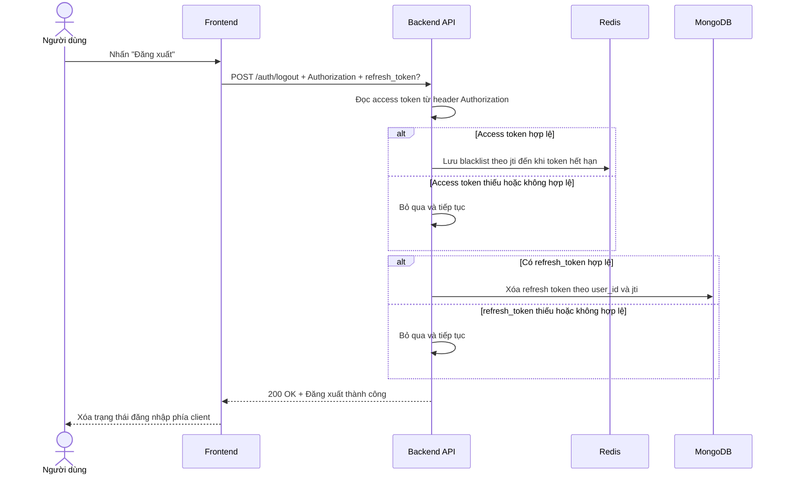

# Software Requirement Specification (SRS)

## Chức năng: Đăng xuất tài khoản (Logout)

### Mermaid Sequence Diagram

**Mã chức năng:** AUTH-LOGOUT-01  
**Trạng thái:** Draft / Review  
**Người soạn thảo:** Phạm Nguyễn Hưng
**Vai trò:** Technical Writer / Developer

---

### 1. Mô tả tổng quan (Description)

Chức năng đăng xuất cho phép người dùng kết thúc phiên đăng nhập hiện tại. API hiện tại được triển khai tại `POST /auth/logout`. Trong source hiện tại, middleware sẽ cố gắng đưa `access token` vào Redis blacklist theo `jti` và xóa `refresh token` tương ứng trong MongoDB nếu phía client gửi kèm. Dù token thiếu, sai định dạng hoặc không hợp lệ, controller vẫn trả phản hồi thành công để tránh làm gián đoạn thao tác đăng xuất phía giao diện.

### 2. Luồng nghiệp vụ (User Workflow)

| Bước | Hành động người dùng                  | Phản hồi hệ thống                                                                                                        |
| :--- | :------------------------------------ | :----------------------------------------------------------------------------------------------------------------------- |
| 1    | Người dùng nhấn nút "Đăng xuất"       | Frontend chuẩn bị gọi API `POST /auth/logout`.                                                                           |
| 2    | Frontend gửi request                  | Có thể kèm `Authorization: Bearer <access_token>` và `refresh_token` trong body.                                         |
| 3    | Hệ thống xử lý access token           | Nếu access token hợp lệ thì verify JWT, lấy `jti` và đưa vào Redis blacklist theo thời gian còn hiệu lực của token.      |
| 4    | Hệ thống xử lý refresh token          | Nếu body có `refresh_token` hợp lệ thì verify JWT và xóa phiên refresh token tương ứng trong collection `refreshTokens`. |
| 5    | Token không hợp lệ hoặc không tồn tại | Middleware bỏ qua lỗi, không chặn request và tiếp tục trả phản hồi thành công.                                           |
| 6    | Hoàn tất đăng xuất                    | API trả `200 OK` với thông báo đăng xuất thành công; frontend tự xóa thông tin phiên ở phía client.                      |

### 3. Yêu cầu dữ liệu (Data Requirements)

#### 3.1. Dữ liệu đầu vào (Input Fields)

- **Authorization header:** tùy chọn, định dạng `Bearer <access_token>`.
- **refresh_token:** `string`, tùy chọn, gửi trong body khi cần thu hồi phiên refresh token hiện tại.

#### 3.2. Dữ liệu đầu ra (Response Data)

Khi xử lý đăng xuất, hệ thống trả về:

- `status`: `success`
- `message`: `Đăng xuất thành công`

#### 3.3. Dữ liệu lưu trữ / truy xuất

- **Redis:** lưu khóa blacklist dạng `blacklist:{jti}` với TTL bằng thời gian còn lại của access token.
- **Collection `refreshTokens`:** xóa bản ghi có `user_id` và `jti` khớp với refresh token được gửi lên.

### 4. Ràng buộc kỹ thuật & bảo mật (Technical Constraints)

- Route `POST /auth/logout` hiện không dùng `zod` validator riêng; dữ liệu được đọc trực tiếp từ header và body.
- Access token được lấy từ header `Authorization`, tách theo tiền tố `Bearer `.
- Nếu verify access token thành công, hệ thống lưu `jti` vào Redis blacklist cho đến khi token tự hết hạn.
- Nếu verify refresh token thành công, hệ thống xóa đúng refresh token theo cặp `user_id` và `jti`.
- Source hiện tại nuốt lỗi verify token trong middleware logout; lỗi token không làm API trả thất bại.
- Để đăng xuất đầy đủ một phiên, frontend nên gửi cả access token hiện tại và `refresh_token`; nếu chỉ gửi một trong hai thì chỉ một phần thông tin phiên được thu hồi.

### 5. Trường hợp ngoại lệ & xử lý lỗi (Edge Cases)

- **Trường hợp:** Không gửi `Authorization` header.
  - **Xử lý:** Vẫn trả `200 OK`; hệ thống không blacklist access token.
- **Trường hợp:** Gửi access token sai, hết hạn hoặc không verify được.
  - **Xử lý:** Middleware bỏ qua lỗi và vẫn cho phép trả `200 OK`.
- **Trường hợp:** Không gửi `refresh_token` trong body.
  - **Xử lý:** Vẫn trả `200 OK`; không xóa bản ghi trong `refreshTokens`.
- **Trường hợp:** Gửi `refresh_token` sai, hết hạn hoặc không tồn tại trong database.
  - **Xử lý:** Middleware bỏ qua lỗi và vẫn trả `200 OK`.
- **Trường hợp:** Body JSON lỗi cú pháp.
  - **Xử lý:** Có thể bị tầng parse request từ chối với `400 Bad Request` trước khi vào controller.
- **Trường hợp:** Redis hoặc database phát sinh lỗi ngoài luồng try/catch nội bộ.
  - **Xử lý:** Hệ thống có thể trả `500 Internal Server Error`.

### 6. Giao diện (UI/UX)

- Nút đăng xuất nên xóa token và dữ liệu phiên ở phía frontend ngay sau khi nhận phản hồi thành công.
- Frontend nên gửi kèm cả `Authorization` và `refresh_token` để đăng xuất trọn vẹn phiên hiện tại.
- Trong trường hợp API trả thành công nhưng token phía server không thu hồi hết do dữ liệu đầu vào thiếu, frontend vẫn phải ưu tiên xóa trạng thái đăng nhập cục bộ.
- Nếu hệ thống có nhiều thiết bị đăng nhập song song, chức năng này hiện chỉ thu hồi phiên được gửi token tương ứng, không phải đăng xuất tất cả thiết bị.

---
