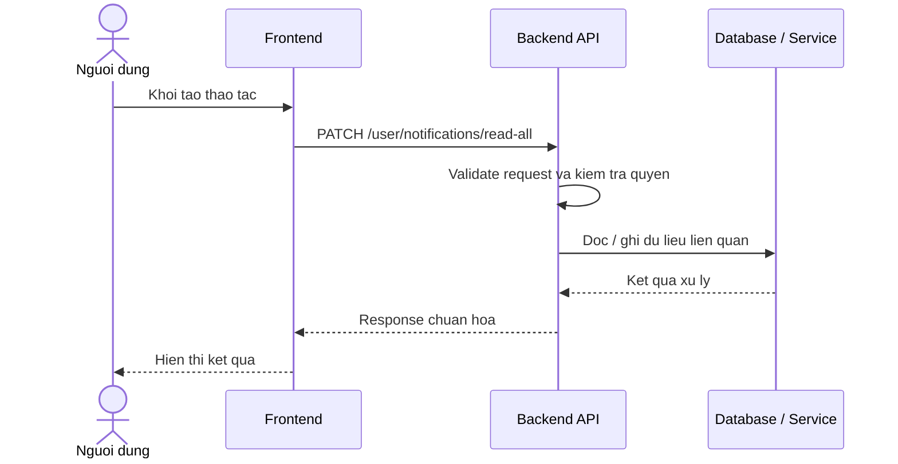

# Software Requirement Specification (SRS)
## Chuc nang: Danh dau tat ca thong bao da doc

### Mermaid Sequence Diagram

**Ma chuc nang:** NOTIFICATION-MARK-ALL-READ-01  
**Trang thai:** Draft / Review  
**Nguoi soan thao:** Nhu Trung Hai  
**Vai tro:** Technical Writer / Developer

---

### 1. Mo ta tong quan (Description)
Chuc nang danh dau toan bo thong bao cua nguoi dung la da doc chi trong mot thao tac. API hien tai duoc trien khai tai `PATCH /user/notifications/read-all`.

### 2. Luong nghiep vu (User Workflow)
| Buoc | Hanh dong nguoi dung | Phan hoi he thong |
| :--- | :--- | :--- |
| 1 | Nguoi dung / quan tri vien mo chuc nang tuong ung | Frontend chuan bi du lieu va goi API. |
| 2 | Frontend gui request den backend | Backend kiem tra du lieu dau vao, token, quyen va ngu canh nghiep vu. |
| 3 | Backend xu ly nghiep vu | He thong doc / ghi du lieu tai MongoDB hoac dich vu phu tro. |
| 4 | Hoan tat | Backend tra response dang `status`, `message`, `data` de frontend cap nhat giao dien. |

### 3. Yeu cau du lieu (Data Requirements)
#### 3.1. Du lieu dau vao (Input Fields)
* Header `Authorization` hop le.

#### 3.2. Du lieu dau ra (Response Data)
* `status: success`
* Thong tin so luong thong bao da duoc cap nhat neu backend tra ve.

#### 3.3. Du lieu luu tru / truy xuat
* Collection `notifications` de cap nhat hang loat cac ban ghi unread cua user.

### 4. Rang buoc ky thuat & bao mat (Technical Constraints)
* Chi ap dung cho thong bao cua user hien tai.
* Nen dung cap nhat bulk de giam so lan ghi DB.

### 5. Truong hop ngoai le & xu ly loi (Edge Cases)
* **Truong hop:** Khong co thong bao unread.  
  * **Xu ly:** Tra thanh cong voi so luong cap nhat bang `0`.
* **Truong hop:** Loi DB khi update nhieu ban ghi.  
  * **Xu ly:** Tra `500 Internal Server Error`.

### 6. Giao dien (UI/UX)
* Notification center nen co nut "Danh dau tat ca da doc".
* Sau khi thanh cong can reset badge unread ve `0`.

---
