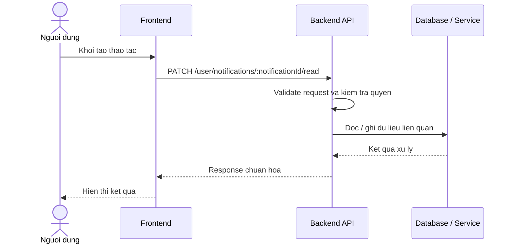

# Software Requirement Specification (SRS)
## Chuc nang: Danh dau mot thong bao da doc

### Mermaid Sequence Diagram

**Ma chuc nang:** NOTIFICATION-MARK-READ-01  
**Trang thai:** Draft / Review  
**Nguoi soan thao:** Nhu Trung Hai  
**Vai tro:** Technical Writer / Developer

---

### 1. Mo ta tong quan (Description)
Chuc nang cap nhat trang thai mot thong bao sang da doc. API hien tai duoc trien khai tai `PATCH /user/notifications/:notificationId/read`.

### 2. Luong nghiep vu (User Workflow)
| Buoc | Hanh dong nguoi dung | Phan hoi he thong |
| :--- | :--- | :--- |
| 1 | Nguoi dung / quan tri vien mo chuc nang tuong ung | Frontend chuan bi du lieu va goi API. |
| 2 | Frontend gui request den backend | Backend kiem tra du lieu dau vao, token, quyen va ngu canh nghiep vu. |
| 3 | Backend xu ly nghiep vu | He thong doc / ghi du lieu tai MongoDB hoac dich vu phu tro. |
| 4 | Hoan tat | Backend tra response dang `status`, `message`, `data` de frontend cap nhat giao dien. |

### 3. Yeu cau du lieu (Data Requirements)
#### 3.1. Du lieu dau vao (Input Fields)
* Header `Authorization` hop le.
* Path param `notificationId` hop le.

#### 3.2. Du lieu dau ra (Response Data)
* `status: success`
* Thong bao xac nhan danh dau da doc.

#### 3.3. Du lieu luu tru / truy xuat
* Collection `notifications` de cap nhat trang thai `is_read`.

### 4. Rang buoc ky thuat & bao mat (Technical Constraints)
* Nguoi dung chi duoc danh dau thong bao thuoc ve minh.
* ID thong bao phai ton tai va hop le.

### 5. Truong hop ngoai le & xu ly loi (Edge Cases)
* **Truong hop:** Notification khong ton tai.  
  * **Xu ly:** Tra `404 Not Found`.
* **Truong hop:** Notification thuoc user khac.  
  * **Xu ly:** Tra `403 Forbidden` hoac `404` theo thiet ke bao mat.

### 6. Giao dien (UI/UX)
* Khi danh dau thanh cong nen cap nhat trang thai item ngay ma khong can reload.
* Unread badge can giam theo du lieu moi.

---
