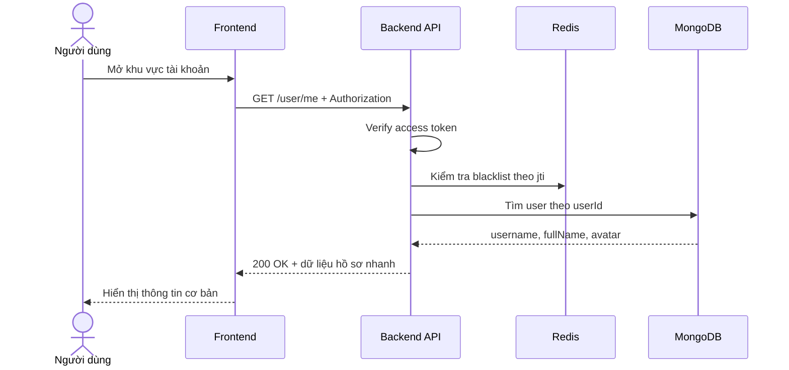

# Software Requirement Specification (SRS)
## Chức năng: Xem hồ sơ nhanh của tôi (Get Me)

### Mermaid Sequence Diagram

**Mã chức năng:** USER-ME-01  
**Trạng thái:** Draft / Review  
**Người soạn thảo:** Phạm Nguyễn Hưng  
**Vai trò:** Technical Writer / Developer

---

### 1. Mô tả tổng quan (Description)
Chức năng `Get Me` cho phép người dùng đã đăng nhập lấy thông tin hồ sơ cơ bản của chính mình để hiển thị trên header, sidebar hoặc khu vực tài khoản. API hiện tại được triển khai tại `GET /user/me`. Hệ thống yêu cầu access token hợp lệ và chỉ trả về 3 trường `username`, `fullName`, `avatar`.

### 2. Luồng nghiệp vụ (User Workflow)
| Bước | Hành động người dùng | Phản hồi hệ thống |
| :--- | :--- | :--- |
| 1 | Người dùng truy cập khu vực cá nhân | Frontend gửi request `GET /user/me`. |
| 2 | Frontend đính kèm access token | Request có header `Authorization: Bearer <access_token>`. |
| 3 | Hệ thống xác thực phiên đăng nhập | Middleware `isAuthorized` verify JWT và kiểm tra blacklist trong Redis. |
| 4 | Hệ thống truy vấn người dùng | Tìm user theo `userId` lấy từ token. |
| 5 | Hệ thống trả dữ liệu hồ sơ nhanh | Chỉ trả `username`, `fullName`, `avatar`. |

### 3. Yêu cầu dữ liệu (Data Requirements)
#### 3.1. Dữ liệu đầu vào (Input Fields)
* **Authorization header:** bắt buộc, định dạng `Bearer <access_token>`.

#### 3.2. Dữ liệu đầu ra (Response Data)
Khi thành công, hệ thống trả về:
* `status`: `success`
* `data.username`: username của người dùng
* `data.fullName`: họ tên hiển thị
* `data.avatar`: đường dẫn hoặc URL ảnh đại diện

#### 3.3. Dữ liệu lưu trữ / truy xuất
* **JWT Access Token:** dùng để lấy `userId`.
* **Redis:** kiểm tra token có nằm trong blacklist hay không.
* **Collection `users`:** truy xuất dữ liệu người dùng với projection giới hạn 3 trường.

### 4. Ràng buộc kỹ thuật & bảo mật (Technical Constraints)
* Route bắt buộc qua middleware `isAuthorized`.
* Access token bị từ chối nếu thiếu, hết hạn, sai chữ ký hoặc đã bị blacklist.
* Projection hiện tại chỉ lấy `username`, `fullName`, `avatar`, không trả thông tin nhạy cảm.
* Source hiện tại không kiểm tra riêng trường hợp user đã bị xóa sau khi token được cấp; khi đó dữ liệu có thể trả về `null`.

### 5. Trường hợp ngoại lệ & xử lý lỗi (Edge Cases)
* **Trường hợp:** Không gửi access token.  
  * **Xử lý:** Trả `401 Unauthorized`.
* **Trường hợp:** Access token hết hạn.  
  * **Xử lý:** Trả `401 Unauthorized` với thông báo phiên đăng nhập hết hạn.
* **Trường hợp:** Access token sai chữ ký hoặc đã bị thu hồi.  
  * **Xử lý:** Trả `401 Unauthorized`.
* **Trường hợp:** User không còn trong database nhưng token vẫn còn hiệu lực.  
  * **Xử lý:** Source hiện tại có thể trả `200 OK` với `data: null`.

### 6. Giao diện (UI/UX)
* Phù hợp để hiển thị avatar nhỏ, tên người dùng và liên kết sang trang cá nhân.
* Frontend nên gọi API này sau khi đăng nhập hoặc khi khởi động lại ứng dụng.
* Nếu API trả `401`, giao diện nên kích hoạt luồng refresh token hoặc điều hướng về đăng nhập.

---
