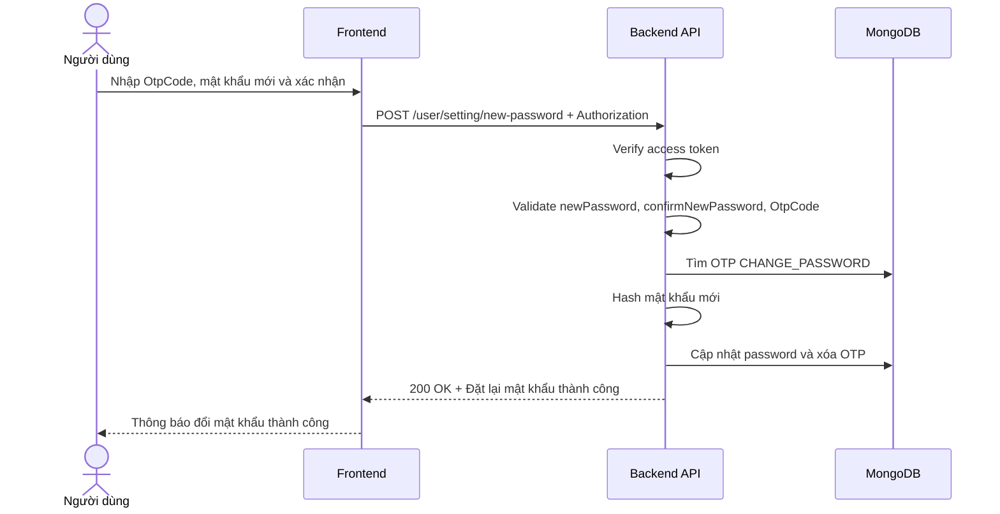

# Software Requirement Specification (SRS)
## Chức năng: Thiết lập mật khẩu mới bằng OTP (New Password)

### Mermaid Sequence Diagram

**Mã chức năng:** USER-NEW-PASSWORD-01  
**Trạng thái:** Draft / Review  
**Người soạn thảo:** Nguyễn Trọng An  
**Vai trò:** Technical Writer / Developer

---

### 1. Mô tả tổng quan (Description)
Chức năng thiết lập mật khẩu mới bằng OTP là bước hoàn tất của luồng đổi mật khẩu khi người dùng đã đăng nhập. API hiện tại được triển khai tại `POST /user/setting/new-password`. Hệ thống kiểm tra `OtpCode`, validate mật khẩu mới, băm mật khẩu rồi cập nhật lại trong database.

### 2. Luồng nghiệp vụ (User Workflow)
| Bước | Hành động người dùng | Phản hồi hệ thống |
| :--- | :--- | :--- |
| 1 | Người dùng nhận OTP từ email | Frontend hiển thị form nhập OTP và mật khẩu mới. |
| 2 | Người dùng nhập `OtpCode`, `newPassword`, `confirmNewPassword` | Frontend gửi request `POST /user/setting/new-password`. |
| 3 | Hệ thống xác thực phiên đăng nhập | Middleware `isAuthorized` kiểm tra access token. |
| 4 | Hệ thống validate dữ liệu đầu vào | Kiểm tra độ dài mật khẩu và xác nhận mật khẩu trùng khớp. |
| 5 | Hệ thống xác minh OTP | Tìm OTP loại `CHANGE_PASSWORD` và kiểm tra hạn sử dụng. |
| 6 | Hệ thống cập nhật mật khẩu | Băm `newPassword`, cập nhật user và xóa OTP đã dùng. |
| 7 | Hoàn tất | Trả `200 OK` với thông báo đặt lại mật khẩu thành công. |

### 3. Yêu cầu dữ liệu (Data Requirements)
#### 3.1. Dữ liệu đầu vào (Input Fields)
* **newPassword:** `string`, bắt buộc, tối thiểu `8`, tối đa `50` ký tự.
* **confirmNewPassword:** `string`, bắt buộc, phải trùng với `newPassword`.
* **OtpCode:** `string`, bắt buộc.

#### 3.2. Dữ liệu đầu ra (Response Data)
Khi thành công, hệ thống trả về:
* `status`: `success`
* `message`: `Đặt lại mật khẩu thành công`

#### 3.3. Dữ liệu lưu trữ / truy xuất
* **Collection `otpCodes`:** kiểm tra và xóa OTP loại `CHANGE_PASSWORD`.
* **Collection `users`:** cập nhật trường `password`, `updated_at`.

### 4. Ràng buộc kỹ thuật & bảo mật (Technical Constraints)
* Route bắt buộc đăng nhập.
* Request được validate bằng `newPasswordValidator`.
* `OtpCode` trong source hiện tại được tra cứu trực tiếp, không băm trước khi so khớp.
* Mật khẩu mới được băm bằng `bcryptjs` trước khi lưu.
* Sau khi cập nhật thành công, OTP bị xóa để tránh tái sử dụng.
* Source hiện tại không thu hồi các access token hoặc refresh token cũ sau khi đổi mật khẩu.

### 5. Trường hợp ngoại lệ & xử lý lỗi (Edge Cases)
* **Trường hợp:** Thiếu access token hoặc token không hợp lệ.  
  * **Xử lý:** Trả `401 Unauthorized`.
* **Trường hợp:** `confirmNewPassword` không trùng với `newPassword`.  
  * **Xử lý:** Trả `422 Unprocessable Entity`.
* **Trường hợp:** `OtpCode` không tồn tại hoặc đã hết hạn.  
  * **Xử lý:** Trả `401 Unauthorized`.
* **Trường hợp:** Body JSON lỗi cú pháp.  
  * **Xử lý:** Trả `400 Bad Request`.
* **Trường hợp:** Lỗi băm mật khẩu hoặc lỗi database.  
  * **Xử lý:** Trả `500 Internal Server Error`.

### 6. Giao diện (UI/UX)
* Form nên có 3 trường: `OtpCode`, `New password`, `Confirm new password`.
* Frontend nên hiển thị rõ đây là OTP được gửi qua email của tài khoản đang đăng nhập.
* Sau khi đổi mật khẩu thành công, giao diện nên yêu cầu người dùng đăng nhập lại để đảm bảo an toàn phiên.

---
