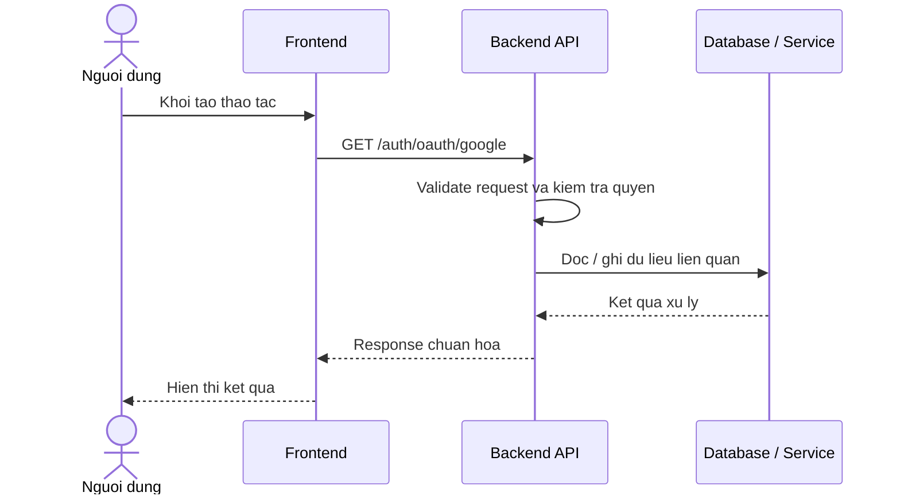

# Software Requirement Specification (SRS)
## Chuc nang: Dang nhap bang Google OAuth

### Mermaid Sequence Diagram

**Ma chuc nang:** AUTH-OAUTH-GOOGLE-01  
**Trang thai:** Draft / Review  
**Nguoi soan thao:** Nhu Trung Hai  
**Vai tro:** Technical Writer / Developer

---

### 1. Mo ta tong quan (Description)
Chuc nang cho phep nguoi dung dang nhap bang tai khoan Google va duoc chuyen huong ve frontend kem access token, refresh token. API hien tai duoc trien khai tai `GET /auth/oauth/google`.

### 2. Luong nghiep vu (User Workflow)
| Buoc | Hanh dong nguoi dung | Phan hoi he thong |
| :--- | :--- | :--- |
| 1 | Nguoi dung / quan tri vien mo chuc nang tuong ung | Frontend chuan bi du lieu va goi API. |
| 2 | Frontend gui request den backend | Backend kiem tra du lieu dau vao, token, quyen va ngu canh nghiep vu. |
| 3 | Backend xu ly nghiep vu | He thong doc / ghi du lieu tai MongoDB hoac dich vu phu tro. |
| 4 | Hoan tat | Backend tra response dang `status`, `message`, `data` de frontend cap nhat giao dien. |

### 3. Yeu cau du lieu (Data Requirements)
#### 3.1. Du lieu dau vao (Input Fields)
* Query `code` do Google OAuth tra ve sau khi nguoi dung chap thuan dang nhap.
* Trinh duyet phai duoc chuyen huong dung ve endpoint backend da cau hinh trong Google Console.

#### 3.2. Du lieu dau ra (Response Data)
* Redirect ve `FRONTEND_URL/oauth/callback` kem `access_token` va `refresh_token` tren query string.
* Thong diep loi hoac redirect loi neu code OAuth khong hop le.

#### 3.3. Du lieu luu tru / truy xuat
* Collection `users` de tim hoac tao nguoi dung OAuth.
* Collection `refresh_tokens` de luu phien dang nhap moi.

### 4. Rang buoc ky thuat & bao mat (Technical Constraints)
* Phai cau hinh `GOOGLE_CLIENT_ID`, `GOOGLE_CLIENT_SECRET`, `GOOGLE_REDIRECT_URL` dung moi truong.
* Backend can goi duoc Google OAuth API va sinh JWT noi bo.

### 5. Truong hop ngoai le & xu ly loi (Edge Cases)
* **Truong hop:** Thieu hoac sai `code` OAuth.  
  * **Xu ly:** Tra loi xac thuc hoac redirect loi.
* **Truong hop:** Khong lay duoc thong tin tai khoan Google.  
  * **Xu ly:** Dung quy trinh, log loi va tra loi he thong.

### 6. Giao dien (UI/UX)
* Frontend can co nut "Dang nhap voi Google".
* Trang callback can doc token tu query string va luu phien dang nhap.

---
