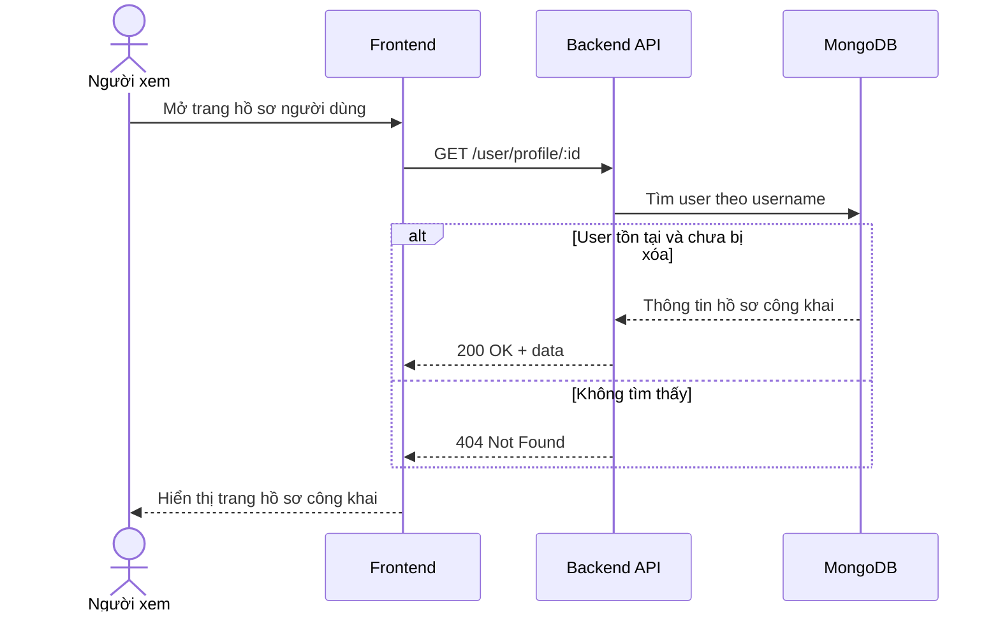

# Software Requirement Specification (SRS)
## Chức năng: Xem hồ sơ công khai người dùng (User Profile)

### Mermaid Sequence Diagram

**Mã chức năng:** USER-PROFILE-01  
**Trạng thái:** Draft / Review  
**Người soạn thảo:** Nguyễn Trọng An  
**Vai trò:** Technical Writer / Developer

---

### 1. Mô tả tổng quan (Description)
Chức năng xem hồ sơ công khai cho phép frontend lấy thông tin hồ sơ của một người dùng khác thông qua `username`. API hiện tại được triển khai tại `GET /user/profile/:id`, trong đó tham số `:id` thực tế đang được dùng như `username`. Hệ thống loại bỏ các trường nhạy cảm trước khi trả dữ liệu.

### 2. Luồng nghiệp vụ (User Workflow)
| Bước | Hành động người dùng | Phản hồi hệ thống |
| :--- | :--- | :--- |
| 1 | Người xem truy cập trang hồ sơ của một thành viên | Frontend gửi request `GET /user/profile/:id`. |
| 2 | Hệ thống tra cứu theo username | Tìm user trong MongoDB với `username = :id`. |
| 3 | Hệ thống lọc dữ liệu công khai | Loại các trường như email, password, role, phone. |
| 4 | Trả kết quả | Nếu user hợp lệ thì trả `200 OK`, nếu không có thì trả `404 Not Found`. |

### 3. Yêu cầu dữ liệu (Data Requirements)
#### 3.1. Dữ liệu đầu vào (Input Fields)
* **Path param `id`:** `string`, bắt buộc, hiện đang đại diện cho `username`.

#### 3.2. Dữ liệu đầu ra (Response Data)
Khi thành công, hệ thống trả về:
* `status`: `success`
* `data`: thông tin hồ sơ công khai của người dùng

Các trường bị loại trừ trong projection:
* `email`
* `password`
* `is_verified`
* `role`
* `updated_at`
* `phone`

#### 3.3. Dữ liệu lưu trữ / truy xuất
* **Collection `users`:** truy xuất hồ sơ theo `username`.

### 4. Ràng buộc kỹ thuật & bảo mật (Technical Constraints)
* Route không yêu cầu đăng nhập.
* Controller dùng projection để ẩn bớt dữ liệu nhạy cảm.
* Nếu user có `status === 2` (`DELETED`) thì hệ thống xem như không tồn tại.
* Source hiện tại xóa trường `status` khỏi object trước khi trả về response.

### 5. Trường hợp ngoại lệ & xử lý lỗi (Edge Cases)
* **Trường hợp:** Không tìm thấy username tương ứng.  
  * **Xử lý:** Trả `404 Not Found`.
* **Trường hợp:** User đã bị đánh dấu xóa mềm (`status = DELETED`).  
  * **Xử lý:** Trả `404 Not Found`.
* **Trường hợp:** Lỗi database khi tra cứu hồ sơ.  
  * **Xử lý:** Trả `500 Internal Server Error`.

### 6. Giao diện (UI/UX)
* API phù hợp cho trang profile công khai, danh sách ứng viên hoặc card hồ sơ.
* Frontend nên dùng `username` để tạo URL thân thiện, ví dụ `/u/nguyenvana`.
* Nếu nhận `404`, giao diện nên hiển thị trang "không tìm thấy người dùng".

---
