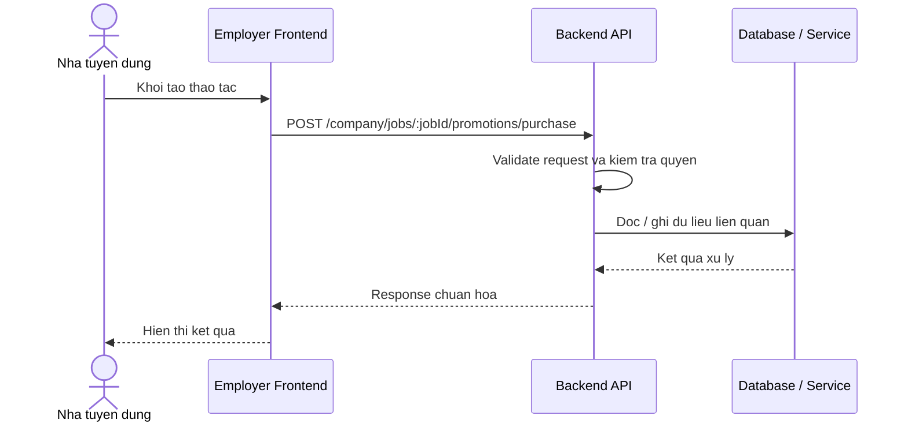

# Software Requirement Specification (SRS)
## Chuc nang: Mua goi quang ba cho tin tuyen dung

### Mermaid Sequence Diagram

**Ma chuc nang:** COMPANY-JOB-PROMOTION-PURCHASE-01  
**Trang thai:** Draft / Review  
**Nguoi soan thao:** Nhu Trung Hai  
**Vai tro:** Technical Writer / Developer

---

### 1. Mo ta tong quan (Description)
Chuc nang cho phep cong ty mua goi quang ba cho mot job cu the de tang do uu tien hien thi. API hien tai duoc trien khai tai `POST /company/jobs/:jobId/promotions/purchase`.

### 2. Luong nghiep vu (User Workflow)
| Buoc | Hanh dong nguoi dung | Phan hoi he thong |
| :--- | :--- | :--- |
| 1 | Nguoi dung / quan tri vien mo chuc nang tuong ung | Frontend chuan bi du lieu va goi API. |
| 2 | Frontend gui request den backend | Backend kiem tra du lieu dau vao, token, quyen va ngu canh nghiep vu. |
| 3 | Backend xu ly nghiep vu | He thong doc / ghi du lieu tai MongoDB hoac dich vu phu tro. |
| 4 | Hoan tat | Backend tra response dang `status`, `message`, `data` de frontend cap nhat giao dien. |

### 3. Yeu cau du lieu (Data Requirements)
#### 3.1. Du lieu dau vao (Input Fields)
* Cong ty da dang nhap va xac minh.
* Path param `jobId` hop le.
* Body lua chon goi promotion theo validator `purchaseCompanyJobPromotionValidator`.

#### 3.2. Du lieu dau ra (Response Data)
* Thong tin promotion vua tao / kich hoat.
* Thong tin so du vi hoac giao dich neu co lien quan.

#### 3.3. Du lieu luu tru / truy xuat
* Collection `job_promotions` de tao chien dich moi.
* Collection `wallets` va `wallet_transactions` neu quy trinh co tru tien vi.

### 4. Rang buoc ky thuat & bao mat (Technical Constraints)
* Job phai thuoc cong ty hien tai.
* Cong ty can du dieu kien va du so du vi theo chinh sach he thong.

### 5. Truong hop ngoai le & xu ly loi (Edge Cases)
* **Truong hop:** So du vi khong du.  
  * **Xu ly:** Tra loi nghiep vu khong cho mua.
* **Truong hop:** Job khong thuoc cong ty hien tai.  
  * **Xu ly:** Tra loi phan quyen.

### 6. Giao dien (UI/UX)
* Man hinh chon goi can hien thi gia va quyen loi ro rang.
* Nen hien thi ket qua thanh toan / tao promotion ngay sau khi mua.

---
