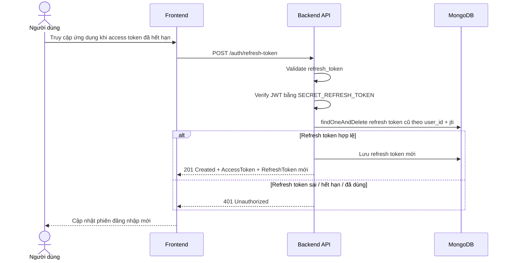

# Software Requirement Specification (SRS)
## Chức năng: Làm mới phiên đăng nhập (Refresh Token)

### Mermaid Sequence Diagram

**Mã chức năng:** AUTH-REFRESH-TOKEN-01  
**Trạng thái:** Draft / Review  
**Người soạn thảo:** Nhữ Trung Hải  
**Vai trò:** Technical Writer / Developer

---

### 1. Mô tả tổng quan (Description)
Chức năng làm mới phiên đăng nhập cho phép frontend đổi `refresh_token` lấy một cặp `AccessToken` và `RefreshToken` mới khi access token hết hạn. API hiện tại được triển khai tại `POST /auth/refresh-token`. Hệ thống verify refresh token, xóa bản ghi refresh token cũ trong MongoDB rồi sinh token mới cho cùng người dùng và thiết bị hiện tại.

### 2. Luồng nghiệp vụ (User Workflow)
| Bước | Hành động người dùng | Phản hồi hệ thống |
| :--- | :--- | :--- |
| 1 | Người dùng tiếp tục sử dụng ứng dụng khi access token đã hết hạn | Frontend phát hiện lỗi `401` và chuẩn bị gọi API làm mới token. |
| 2 | Frontend gửi request `POST /auth/refresh-token` | Body chứa `refresh_token`. |
| 3 | Hệ thống kiểm tra dữ liệu đầu vào | Validate `refresh_token` bằng `zod`. |
| 4 | Hệ thống xác minh refresh token | Verify JWT bằng `SECRET_REFRESH_TOKEN`. |
| 5 | Hệ thống kiểm tra token trong database | Tìm và xóa bản ghi `refreshTokens` theo `user_id` và `jti` của token cũ. |
| 6 | Hệ thống cấp token mới | Sinh `AccessToken`, `RefreshToken` mới và lưu refresh token mới kèm `device_info`. |
| 7 | Hoàn tất | Trả `201 Created` cùng dữ liệu token mới. |

### 3. Yêu cầu dữ liệu (Data Requirements)
#### 3.1. Dữ liệu đầu vào (Input Fields)
* **refresh_token:** `string`, bắt buộc, gửi trong body request.

#### 3.2. Dữ liệu đầu ra (Response Data)
Khi làm mới token thành công, hệ thống trả về:
* `status`: `success`
* `message`: `Làm mới token thành công`
* `data.id`: ID người dùng
* `data.AccessToken`: JWT access token mới
* `data.RefreshToken`: JWT refresh token mới

#### 3.3. Dữ liệu lưu trữ / truy xuất
* **Collection `refreshTokens`:**
  * tìm và xóa refresh token cũ theo `user_id` và `jti`
  * lưu refresh token mới kèm `device_info`, `expires_at`

### 4. Ràng buộc kỹ thuật & bảo mật (Technical Constraints)
* Request được validate bằng `refreshValidator`.
* Refresh token chỉ dùng được một lần vì middleware dùng `findOneAndDelete()` trước khi controller cấp token mới.
* `device_info` của phiên mới được lấy lại từ `User-Agent`.
* Source hiện tại giữ nguyên thời gian hết hạn của refresh token cũ khi cấp refresh token mới, thay vì gia hạn thêm một chu kỳ mới.
* Nếu refresh token đã bị xóa khỏi database hoặc bị dùng lại, hệ thống trả `401 Unauthorized`.

### 5. Trường hợp ngoại lệ & xử lý lỗi (Edge Cases)
* **Trường hợp:** Không gửi `refresh_token`.  
  * **Xử lý:** Trả `422 Unprocessable Entity`.
* **Trường hợp:** `refresh_token` sai định dạng, sai chữ ký hoặc hết hạn.  
  * **Xử lý:** Trả `401 Unauthorized`.
* **Trường hợp:** `refresh_token` hợp lệ nhưng không còn trong collection `refreshTokens`.  
  * **Xử lý:** Trả `401 Unauthorized` vì token đã bị thu hồi hoặc đã dùng trước đó.
* **Trường hợp:** Body JSON lỗi cú pháp.  
  * **Xử lý:** Trả `400 Bad Request`.
* **Trường hợp:** Lỗi database khi xóa/lưu refresh token.  
  * **Xử lý:** Trả `500 Internal Server Error`.

### 6. Giao diện (UI/UX)
* Frontend nên tự động gọi `POST /auth/refresh-token` khi access token hết hạn.
* Sau khi nhận token mới, frontend cần thay cả `AccessToken` lẫn `RefreshToken` cùng lúc.
* Nếu refresh thất bại, giao diện nên xóa phiên cục bộ và đưa người dùng về màn hình đăng nhập.

---
