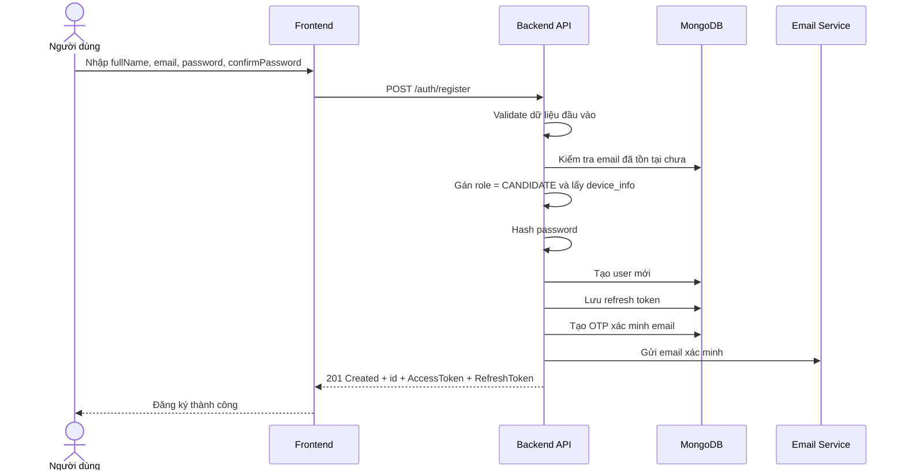

# Software Requirement Specification (SRS)
## Chức năng: Đăng ký tài khoản (Register)

### Mermaid Sequence Diagram

**Mã chức năng:** AUTH-REGISTER-01  
**Trạng thái:** Draft / Review  
**Người soạn thảo:** Phạm Nguyễn Hưng  
**Vai trò:** Technical Writer / Developer

---

### 1. Mô tả tổng quan (Description)
Chức năng đăng ký cho phép người dùng tạo tài khoản mới trong hệ thống bằng họ tên, email và mật khẩu. API hiện tại được triển khai tại `POST /auth/register`. Sau khi tạo tài khoản thành công, hệ thống sinh token đăng nhập, tạo mã xác minh email và gửi link xác minh đến địa chỉ email người dùng.

### 2. Luồng nghiệp vụ (User Workflow)
| Bước | Hành động người dùng | Phản hồi hệ thống |
| :--- | :--- | :--- |
| 1 | Truy cập màn hình đăng ký | Hiển thị form gồm Full name, Email, Password, Confirm password. |
| 2 | Nhập thông tin và nhấn "Đăng ký" | Frontend gửi request `POST /auth/register`. |
| 3 | Hệ thống kiểm tra dữ liệu đầu vào | Validate họ tên, email, mật khẩu và xác nhận mật khẩu bằng `zod`. |
| 4 | Hệ thống kiểm tra trùng email | Tra cứu email trong database, nếu đã tồn tại thì từ chối đăng ký. |
| 5 | Hệ thống tạo tài khoản mới | Gán vai trò mặc định là `CANDIDATE`, hash mật khẩu, sinh `username` tự động và lưu user mới. |
| 6 | Hệ thống tạo phiên đăng nhập | Sinh `AccessToken`, `RefreshToken`, lưu refresh token theo thiết bị. |
| 7 | Hệ thống gửi xác minh email | Tạo token xác minh email, lưu mã băm vào collection OTP và gửi email xác minh. |
| 8 | Đăng ký thành công | Trả `201 Created` cùng thông tin tài khoản và token. |

### 3. Yêu cầu dữ liệu (Data Requirements)
#### 3.1. Dữ liệu đầu vào (Input Fields)
* **fullName:** `string`, bắt buộc, tối thiểu `2` ký tự, tối đa `100` ký tự.
* **email:** `string`, bắt buộc, đúng định dạng email, được `trim()` và chuyển về chữ thường.
* **password:** `string`, bắt buộc, tối thiểu `8` ký tự, tối đa `50` ký tự.
* **confirmPassword:** `string`, bắt buộc, phải trùng khớp với `password`.

#### 3.2. Dữ liệu đầu ra (Response Data)
Khi đăng ký thành công, hệ thống trả về:
* `status`: `success`
* `message`: `Đăng ký tài khoản thành công`
* `data.id`: ID người dùng mới
* `data.AccessToken`: JWT access token
* `data.RefreshToken`: JWT refresh token

#### 3.3. Dữ liệu lưu trữ / truy xuất
* **Collection `users`:**
  * `fullName`
  * `username` được sinh tự động
  * `email` là duy nhất
  * `password` đã băm
  * `role` mặc định là `CANDIDATE`
  * `is_verified` mặc định là `false`
  * `status` mặc định là `ACTIVE`
* **Collection `refreshTokens`:** lưu refresh token theo `user_id`, `jti`, `device_info`, `expires_at`.
* **Collection `otpCodes`:** lưu mã xác minh email đã băm với `type = VERIFY_EMAIL` và thời gian hết hạn.

### 4. Ràng buộc kỹ thuật & bảo mật (Technical Constraints)
* Validate request bằng `zod` trước khi kiểm tra nghiệp vụ.
* Email phải là duy nhất; nếu trùng sẽ trả lỗi `409 Conflict`.
* Mật khẩu được băm bằng `bcryptjs` trước khi lưu xuống database.
* Link xác minh email dùng token ngẫu nhiên; database chỉ lưu bản băm `sha256` của token, không lưu token gốc.
* `device_info` được trích từ `User-Agent` và dùng khi lưu refresh token.
* Trong source hiện tại, tài khoản mới đăng ký được cấp token ngay sau khi tạo user, đồng thời `is_verified` vẫn là `false` cho đến khi xác minh email.
* Ở môi trường `production`, email xác minh được gửi qua Resend; ở môi trường `dev`, link xác minh được log ra console.

### 5. Trường hợp ngoại lệ & xử lý lỗi (Edge Cases)
* **Trường hợp:** Email sai định dạng, họ tên quá ngắn/quá dài, mật khẩu không đạt điều kiện.  
  * **Xử lý:** Trả `422 Unprocessable Entity`.
* **Trường hợp:** `confirmPassword` không khớp với `password`.  
  * **Xử lý:** Trả `422 Unprocessable Entity` với lỗi tại trường `confirmPassword`.
* **Trường hợp:** Email đã tồn tại trong hệ thống.  
  * **Xử lý:** Trả `409 Conflict`.
* **Trường hợp:** Lỗi trong quá trình gửi email xác minh sau khi user đã được tạo.  
  * **Xử lý:** Hệ thống có thể trả `500 Internal Server Error`; do source hiện tại chưa dùng transaction nên cần lưu ý khi hoàn thiện nghiệp vụ.
* **Trường hợp:** Body JSON bị lỗi cú pháp.  
  * **Xử lý:** Trả `400 Bad Request`.

### 6. Giao diện (UI/UX)
* Form đăng ký nên có 4 trường: `Full name`, `Email`, `Password`, `Confirm password`.
* Cần hiển thị lỗi validate trực tiếp theo từng trường.
* Sau khi đăng ký thành công, frontend nên thông báo cho người dùng kiểm tra email để xác minh tài khoản.
* Nút đăng ký cần có trạng thái loading để tránh submit lặp.

---
