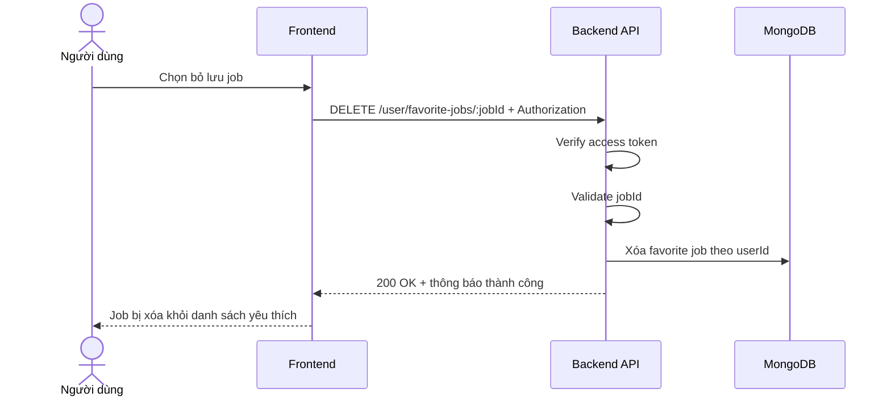

# Software Requirement Specification (SRS)
## Chức năng: Bỏ lưu việc làm yêu thích (Remove Favorite Job)

### Mermaid Sequence Diagram

**Mã chức năng:** FAVORITE-REMOVE-01  
**Trạng thái:** Draft / Review  
**Người soạn thảo:** Nhữ Trung Hải  
**Vai trò:** Technical Writer / Developer

---

### 1. Mô tả tổng quan (Description)
Chức năng bỏ lưu việc làm yêu thích cho phép người dùng loại một job ra khỏi danh sách đã lưu. API hiện tại được triển khai tại `DELETE /user/favorite-jobs/:jobId`.

### 2. Luồng nghiệp vụ (User Workflow)
| Bước | Hành động người dùng | Phản hồi hệ thống |
| :--- | :--- | :--- |
| 1 | Người dùng nhấn bỏ yêu thích | Frontend gửi request xóa. |
| 2 | Backend xác thực và validate | Kiểm tra token và `jobId`. |
| 3 | Backend xóa dữ liệu favorite | Xóa bản ghi của user tương ứng. |
| 4 | Hoàn tất | Trả thông báo xóa thành công. |

### 3. Yêu cầu dữ liệu (Data Requirements)
#### 3.1. Dữ liệu đầu vào (Input Fields)
* **Authorization:** bắt buộc.
* **jobId:** Mongo ObjectId hợp lệ.

#### 3.2. Dữ liệu đầu ra (Response Data)
* `status`
* `message`

#### 3.3. Dữ liệu lưu trữ / truy xuất
* Dữ liệu favorite jobs của người dùng

### 4. Ràng buộc kỹ thuật & bảo mật (Technical Constraints)
* Route yêu cầu đăng nhập.

### 5. Trường hợp ngoại lệ & xử lý lỗi (Edge Cases)
* **Trường hợp:** `jobId` không hợp lệ.  
  * **Xử lý:** Trả `422 Unprocessable Entity`.
* **Trường hợp:** Bản ghi favorite không tồn tại.  
  * **Xử lý:** Hệ thống trả lỗi hoặc xử lý idempotent theo service.

### 6. Giao diện (UI/UX)
* Sau khi bỏ lưu, danh sách yêu thích cần được cập nhật ngay.

---
