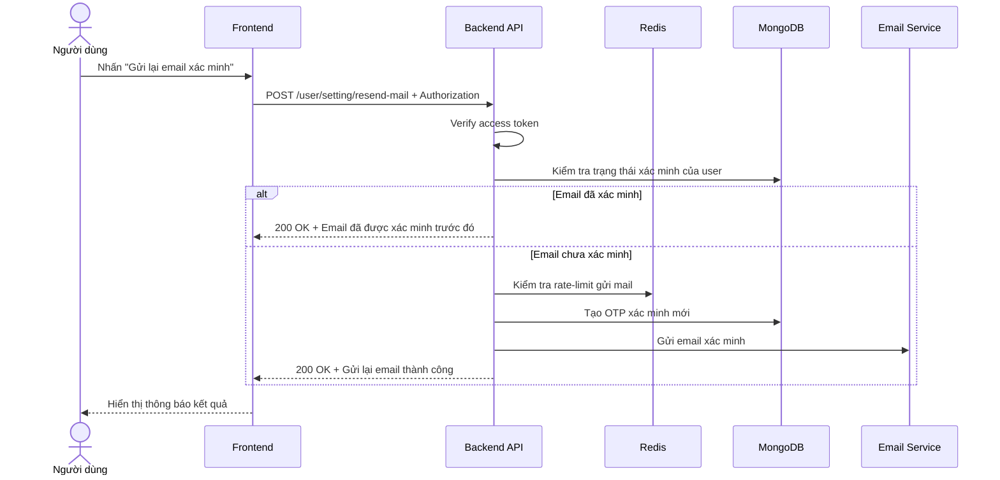

# Software Requirement Specification (SRS)
## Chức năng: Gửi lại email xác minh (Resend Verify Email)

### Mermaid Sequence Diagram

**Mã chức năng:** USER-RESEND-MAIL-01  
**Trạng thái:** Draft / Review  
**Người soạn thảo:** Nhữ Trung Hải  
**Vai trò:** Technical Writer / Developer

---

### 1. Mô tả tổng quan (Description)
Chức năng gửi lại email xác minh cho phép người dùng đã đăng nhập nhưng chưa xác minh email yêu cầu hệ thống gửi lại liên kết xác minh. API hiện tại được triển khai tại `POST /user/setting/resend-mail`. Route yêu cầu đăng nhập, kiểm tra trạng thái xác minh và áp dụng rate-limit gửi mail.

### 2. Luồng nghiệp vụ (User Workflow)
| Bước | Hành động người dùng | Phản hồi hệ thống |
| :--- | :--- | :--- |
| 1 | Người dùng nhấn nút gửi lại email xác minh | Frontend gọi `POST /user/setting/resend-mail`. |
| 2 | Hệ thống xác thực phiên đăng nhập | Middleware `isAuthorized` kiểm tra access token. |
| 3 | Hệ thống kiểm tra người dùng đã xác minh chưa | Nếu đã xác minh thì trả thành công ngay với thông báo đã xác minh trước đó. |
| 4 | Hệ thống kiểm tra giới hạn gửi mail | Áp dụng `mailLimiter` theo IP + `User-Agent`. |
| 5 | Hệ thống tạo mã xác minh mới | Sinh token mới, lưu OTP mới vào MongoDB. |
| 6 | Hệ thống gửi email | Gửi email xác minh qua Resend hoặc log link ở môi trường dev. |
| 7 | Hoàn tất | Trả `200 OK` với thông báo gửi lại email thành công. |

### 3. Yêu cầu dữ liệu (Data Requirements)
#### 3.1. Dữ liệu đầu vào (Input Fields)
* **Authorization header:** bắt buộc, định dạng `Bearer <access_token>`.
* Route hiện tại không yêu cầu body.

#### 3.2. Dữ liệu đầu ra (Response Data)
Khi thành công, hệ thống trả về một trong hai phản hồi:
* `status`: `success`
* `message`: `Gửi lại email thành công hãy kiểm tra hòm thư của bạn`

hoặc

* `status`: `success`
* `message`: `Email đã được xác minh trước đó`

#### 3.3. Dữ liệu lưu trữ / truy xuất
* **Collection `users`:** lấy thông tin `fullName`, `email`, `is_verified`.
* **Collection `otpCodes`:** lưu OTP xác minh email mới.
* **Redis rate-limit store:** giới hạn số lần gửi mail.

### 4. Ràng buộc kỹ thuật & bảo mật (Technical Constraints)
* Route bắt buộc đăng nhập.
* `mailLimiter` giới hạn tối đa `3` request trong `15 phút` trên mỗi tổ hợp IP và `User-Agent`.
* Nếu người dùng đã xác minh email thì route không gửi mail mới.
* Ở `production`, mail được gửi bằng Resend; ở `dev`, link xác minh được log ra console.
* Source hiện tại gọi `handlerOtpCode(..., OtpType.UPDATE_EMAIL)` nhưng payload được lưu với `type = VERIFY_EMAIL`, nên các OTP xác minh email cũ có thể không bị dọn đúng như mong đợi.

### 5. Trường hợp ngoại lệ & xử lý lỗi (Edge Cases)
* **Trường hợp:** Không gửi access token.  
  * **Xử lý:** Trả `401 Unauthorized`.
* **Trường hợp:** Người dùng đã xác minh email.  
  * **Xử lý:** Trả `200 OK` với thông báo đã xác minh trước đó.
* **Trường hợp:** Gửi mail vượt quá giới hạn.  
  * **Xử lý:** Trả `429 Too Many Requests`.
* **Trường hợp:** User không tồn tại dù token vẫn hợp lệ.  
  * **Xử lý:** Source hiện tại có thể gây lỗi nội bộ ở bước dựng payload gửi mail.
* **Trường hợp:** Lỗi gửi email hoặc lỗi lưu OTP.  
  * **Xử lý:** Trả `500 Internal Server Error`.

### 6. Giao diện (UI/UX)
* Nút gửi lại email chỉ nên hiển thị khi `is_verified = false`.
* Sau khi gửi thành công, giao diện nên thông báo rõ người dùng kiểm tra inbox hoặc spam.
* Khi bị rate-limit, frontend nên khóa tạm nút gửi lại và hiển thị thời gian chờ hợp lý.

---
