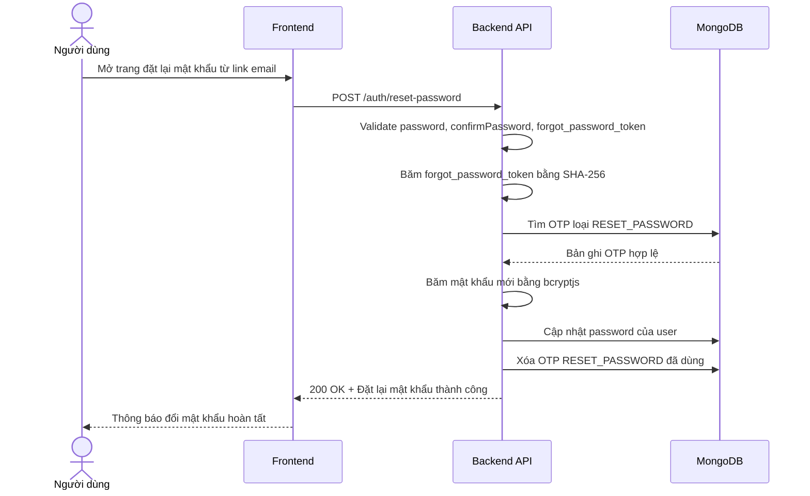

# Software Requirement Specification (SRS)
## Chức năng: Đặt lại mật khẩu (Reset Password)

### Mermaid Sequence Diagram

**Mã chức năng:** AUTH-RESET-PASSWORD-01  
**Trạng thái:** Draft / Review  
**Người soạn thảo:** Nhữ Trung Hải 
**Vai trò:** Technical Writer / Developer

---

### 1. Mô tả tổng quan (Description)
Chức năng đặt lại mật khẩu cho phép người dùng cập nhật mật khẩu mới sau khi đã nhận được link hợp lệ từ luồng quên mật khẩu. API hiện tại được triển khai tại `POST /auth/reset-password`. Hệ thống nhận `forgot_password_token`, kiểm tra token trong collection OTP loại `RESET_PASSWORD`, băm mật khẩu mới bằng `bcryptjs`, cập nhật lại trường `password` của user và xóa OTP đã sử dụng.

### 2. Luồng nghiệp vụ (User Workflow)
| Bước | Hành động người dùng | Phản hồi hệ thống |
| :--- | :--- | :--- |
| 1 | Người dùng mở link đặt lại mật khẩu từ email | Frontend hiển thị form nhập mật khẩu mới và xác nhận mật khẩu. |
| 2 | Người dùng nhập thông tin và nhấn xác nhận | Frontend gửi request `POST /auth/reset-password`. |
| 3 | Hệ thống kiểm tra dữ liệu đầu vào | Validate `password`, `confirmPassword`, `forgot_password_token` bằng `zod`. |
| 4 | Hệ thống xác minh token đặt lại mật khẩu | Băm token, tra cứu `otpCodes` với `type = RESET_PASSWORD` và kiểm tra hạn sử dụng. |
| 5 | Hệ thống cập nhật mật khẩu | Băm mật khẩu mới bằng `bcryptjs` rồi cập nhật lại user trong MongoDB. |
| 6 | Hệ thống vô hiệu OTP đã dùng | Xóa bản ghi OTP `RESET_PASSWORD` tương ứng để tránh tái sử dụng. |
| 7 | Hoàn tất | Trả `200 OK` với thông báo đặt lại mật khẩu thành công. |

### 3. Yêu cầu dữ liệu (Data Requirements)
#### 3.1. Dữ liệu đầu vào (Input Fields)
* **password:** `string`, bắt buộc, tối thiểu `8` ký tự, tối đa `50` ký tự.
* **confirmPassword:** `string`, bắt buộc, phải trùng khớp với `password`.
* **forgot_password_token:** `string`, bắt buộc.

#### 3.2. Dữ liệu đầu ra (Response Data)
Khi đặt lại mật khẩu thành công, hệ thống trả về:
* `status`: `success`
* `message`: `Đặt lại mật khẩu thành công`

#### 3.3. Dữ liệu lưu trữ / truy xuất
* **Collection `otpCodes`:** tra cứu và xóa OTP với `type = RESET_PASSWORD`.
* **Collection `users`:** cập nhật trường `password` và `updated_at`.

### 4. Ràng buộc kỹ thuật & bảo mật (Technical Constraints)
* Request được validate bằng `zod` qua `resetPasswordValidator`.
* `confirmPassword` phải trùng khớp với `password`; nếu không sẽ bị từ chối ở bước validate.
* `forgot_password_token` được băm bằng `hashToken()` trước khi tra cứu trong database.
* Chỉ OTP có `type = RESET_PASSWORD` và còn hạn sử dụng mới được chấp nhận.
* Mật khẩu mới được băm bằng `bcryptjs` trước khi cập nhật xuống collection `users`.
* Sau khi đổi mật khẩu thành công, OTP reset password bị xóa để tránh tái sử dụng.
* Source hiện tại không cấp token đăng nhập mới sau khi đặt lại mật khẩu và cũng chưa thu hồi các refresh token cũ đang tồn tại của người dùng.

### 5. Trường hợp ngoại lệ & xử lý lỗi (Edge Cases)
* **Trường hợp:** Không gửi `forgot_password_token`.  
  * **Xử lý:** Trả `422 Unprocessable Entity`.
* **Trường hợp:** `password` không đạt độ dài tối thiểu/tối đa.  
  * **Xử lý:** Trả `422 Unprocessable Entity`.
* **Trường hợp:** `confirmPassword` không trùng với `password`.  
  * **Xử lý:** Trả `422 Unprocessable Entity` với lỗi tại trường `confirmPassword`.
* **Trường hợp:** `forgot_password_token` không hợp lệ hoặc đã hết hạn.  
  * **Xử lý:** Trả `401 Unauthorized`.
* **Trường hợp:** Body JSON lỗi cú pháp.  
  * **Xử lý:** Trả `400 Bad Request`.
* **Trường hợp:** Lỗi khi cập nhật database hoặc băm mật khẩu.  
  * **Xử lý:** Trả `500 Internal Server Error`.

### 6. Giao diện (UI/UX)
* Màn hình đặt lại mật khẩu nên có tối thiểu 2 trường: `Password`, `Confirm password`.
* Frontend cần lấy `forgot_password_token` từ link email và gửi lại đúng trong body request.
* Sau khi đặt lại mật khẩu thành công, giao diện nên điều hướng người dùng về màn hình đăng nhập.
* Vì source hiện tại chưa tự thu hồi các phiên đăng nhập cũ sau reset password, frontend nên chủ động yêu cầu người dùng đăng nhập lại bằng mật khẩu mới.

---
