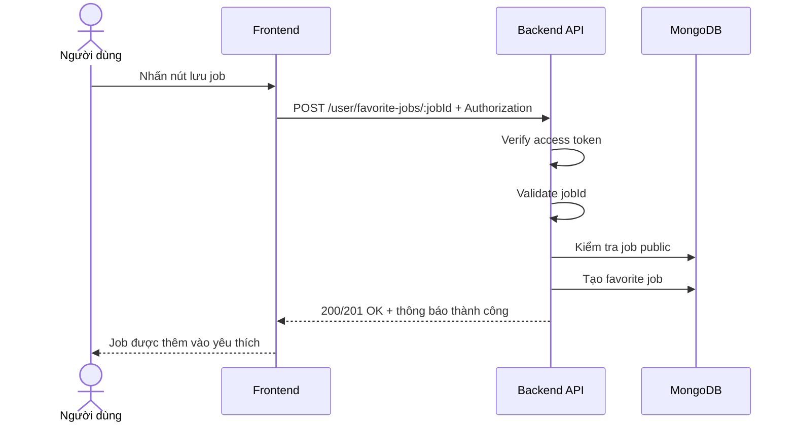

# Software Requirement Specification (SRS)
## Chức năng: Lưu việc làm yêu thích (Save Favorite Job)

### Mermaid Sequence Diagram

**Mã chức năng:** FAVORITE-SAVE-01  
**Trạng thái:** Draft / Review  
**Người soạn thảo:** Nguyễn Trọng An  
**Vai trò:** Technical Writer / Developer

---

### 1. Mô tả tổng quan (Description)
Chức năng lưu việc làm yêu thích cho phép người dùng đánh dấu một job public để xem lại sau. API hiện tại được triển khai tại `POST /user/favorite-jobs/:jobId`.

### 2. Luồng nghiệp vụ (User Workflow)
| Bước | Hành động người dùng | Phản hồi hệ thống |
| :--- | :--- | :--- |
| 1 | Người dùng bấm icon lưu job | Frontend gọi API lưu favorite. |
| 2 | Backend xác thực và validate | Kiểm tra token và `jobId`. |
| 3 | Backend kiểm tra job public | Chỉ cho lưu job hợp lệ. |
| 4 | Backend lưu dữ liệu yêu thích | Tạo bản ghi favorite cho user. |
| 5 | Hoàn tất | Trả thông báo lưu thành công. |

### 3. Yêu cầu dữ liệu (Data Requirements)
#### 3.1. Dữ liệu đầu vào (Input Fields)
* **Authorization:** bắt buộc.
* **jobId:** Mongo ObjectId hợp lệ.

#### 3.2. Dữ liệu đầu ra (Response Data)
* `status`
* `message`

#### 3.3. Dữ liệu lưu trữ / truy xuất
* Dữ liệu favorite jobs
* Job public được load qua middleware

### 4. Ràng buộc kỹ thuật & bảo mật (Technical Constraints)
* Route yêu cầu đăng nhập.
* Job phải tồn tại và hợp lệ trước khi lưu.

### 5. Trường hợp ngoại lệ & xử lý lỗi (Edge Cases)
* **Trường hợp:** Job không tồn tại.  
  * **Xử lý:** Trả `404 Not Found`.
* **Trường hợp:** Chưa đăng nhập.  
  * **Xử lý:** Trả `401 Unauthorized`.

### 6. Giao diện (UI/UX)
* Icon favorite nên đổi trạng thái ngay sau khi lưu thành công.

---
