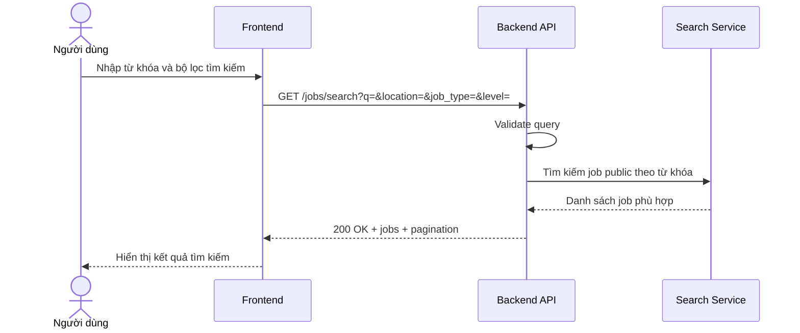

# Software Requirement Specification (SRS)
## Chức năng: Tìm kiếm việc làm công khai (Search Public Jobs)

### Mermaid Sequence Diagram

**Mã chức năng:** JOB-PUBLIC-SEARCH-01  
**Trạng thái:** Draft / Review  
**Người soạn thảo:** Nhữ Trung Hải  
**Vai trò:** Technical Writer / Developer

---

### 1. Mô tả tổng quan (Description)
Chức năng tìm kiếm việc làm công khai cho phép người dùng hoặc khách truy cập tìm các tin tuyển dụng đang hiển thị công khai theo từ khóa và các bộ lọc cơ bản. API hiện tại được triển khai tại `GET /jobs/search`.

### 2. Luồng nghiệp vụ (User Workflow)
| Bước | Hành động người dùng | Phản hồi hệ thống |
| :--- | :--- | :--- |
| 1 | Người dùng mở trang tìm kiếm việc làm | Frontend hiển thị ô từ khóa và bộ lọc. |
| 2 | Người dùng nhập dữ liệu tìm kiếm | Frontend gọi `GET /jobs/search`. |
| 3 | Hệ thống kiểm tra query | Validate `q`, `page`, `limit`, `location`, `job_type`, `level`. |
| 4 | Hệ thống gọi service tìm kiếm | Backend truy vấn nguồn dữ liệu search và chuẩn hóa kết quả. |
| 5 | Hoàn tất | Trả `200 OK` cùng danh sách job và phân trang. |

### 3. Yêu cầu dữ liệu (Data Requirements)
#### 3.1. Dữ liệu đầu vào (Input Fields)
* **q:** `string`, bắt buộc, tối thiểu `2` ký tự.
* **page:** `number`, tùy chọn, mặc định `1`.
* **limit:** `number`, tùy chọn, mặc định theo validator.
* **location:** `string`, tùy chọn.
* **job_type:** `full-time | part-time | internship | contract | remote`, tùy chọn.
* **level:** `intern | fresher | junior | middle | senior | lead | manager`, tùy chọn.

#### 3.2. Dữ liệu đầu ra (Response Data)
* `status`: `success`
* `data.items` hoặc `data.jobs`: danh sách job public
* `data.pagination.page`
* `data.pagination.limit`
* `data.pagination.total`
* `data.pagination.total_pages`

#### 3.3. Dữ liệu lưu trữ / truy xuất
* Nguồn dữ liệu search của hệ thống.
* Dữ liệu job public và thông tin công ty liên quan.

### 4. Ràng buộc kỹ thuật & bảo mật (Technical Constraints)
* API không yêu cầu đăng nhập.
* Chỉ trả về các job public hợp lệ.
* Query phải qua validator trước khi truy vấn search service.

### 5. Trường hợp ngoại lệ & xử lý lỗi (Edge Cases)
* **Trường hợp:** Thiếu từ khóa hoặc từ khóa quá ngắn.  
  * **Xử lý:** Trả `422 Unprocessable Entity`.
* **Trường hợp:** Bộ lọc không hợp lệ.  
  * **Xử lý:** Trả `422 Unprocessable Entity`.
* **Trường hợp:** Search service lỗi.  
  * **Xử lý:** Trả `500 Internal Server Error`.

### 6. Giao diện (UI/UX)
* Trang tìm kiếm nên hỗ trợ ô nhập từ khóa và bộ lọc nhanh.
* Nên hiển thị phân trang, tổng số kết quả và trạng thái loading.
* Mỗi kết quả nên có link sang trang chi tiết job.

---
