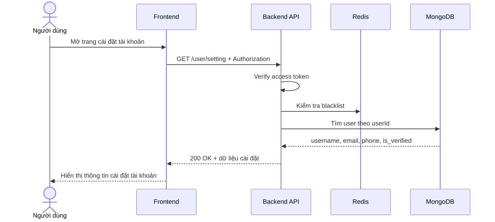

# Software Requirement Specification (SRS)
## Chức năng: Xem cài đặt tài khoản (Get User Setting)

### Mermaid Sequence Diagram

**Mã chức năng:** USER-SETTING-01  
**Trạng thái:** Draft / Review  
**Người soạn thảo:** Phạm Nguyễn Hưng  
**Vai trò:** Technical Writer / Developer

---

### 1. Mô tả tổng quan (Description)
Chức năng xem cài đặt tài khoản cho phép người dùng đã đăng nhập lấy các thông tin cấu hình cơ bản liên quan đến tài khoản. API hiện tại được triển khai tại `GET /user/setting`. Hệ thống trả về `username`, `email`, `phone` và trạng thái xác minh email `is_verified`.

### 2. Luồng nghiệp vụ (User Workflow)
| Bước | Hành động người dùng | Phản hồi hệ thống |
| :--- | :--- | :--- |
| 1 | Người dùng mở trang cài đặt | Frontend gọi `GET /user/setting`. |
| 2 | Hệ thống xác thực phiên đăng nhập | Middleware `isAuthorized` kiểm tra access token và blacklist. |
| 3 | Hệ thống truy vấn thông tin tài khoản | Tìm user theo `userId` trong token. |
| 4 | Trả kết quả | Trả về dữ liệu cài đặt cần hiển thị trên giao diện. |

### 3. Yêu cầu dữ liệu (Data Requirements)
#### 3.1. Dữ liệu đầu vào (Input Fields)
* **Authorization header:** bắt buộc, định dạng `Bearer <access_token>`.

#### 3.2. Dữ liệu đầu ra (Response Data)
Khi thành công, hệ thống trả về:
* `status`: `success`
* `data.username`
* `data.email`
* `data.phone`
* `data.is_verified`

#### 3.3. Dữ liệu lưu trữ / truy xuất
* **JWT Access Token:** lấy `userId`.
* **Collection `users`:** truy vấn dữ liệu cài đặt bằng projection giới hạn.

### 4. Ràng buộc kỹ thuật & bảo mật (Technical Constraints)
* Route bắt buộc qua middleware `isAuthorized`.
* Access token bị chặn nếu hết hạn hoặc bị blacklist.
* Dữ liệu trả về chỉ gồm 4 trường phục vụ màn hình cài đặt, không có password hay refresh token.
* Source hiện tại không có API tách riêng cho các cấu hình nâng cao khác như thông báo, riêng tư hay ngôn ngữ.

### 5. Trường hợp ngoại lệ & xử lý lỗi (Edge Cases)
* **Trường hợp:** Thiếu hoặc sai access token.  
  * **Xử lý:** Trả `401 Unauthorized`.
* **Trường hợp:** User không còn trong database.  
  * **Xử lý:** Source hiện tại có thể trả `200 OK` với `data: null`.
* **Trường hợp:** Lỗi database.  
  * **Xử lý:** Trả `500 Internal Server Error`.

### 6. Giao diện (UI/UX)
* Phù hợp cho tab "Cài đặt tài khoản" hoặc "Bảo mật".
* Frontend nên dùng dữ liệu này làm nguồn ban đầu cho form cập nhật số điện thoại hoặc gửi lại email xác minh.
* Nếu `is_verified = false`, giao diện nên hiển thị CTA gửi lại email xác minh.

---
