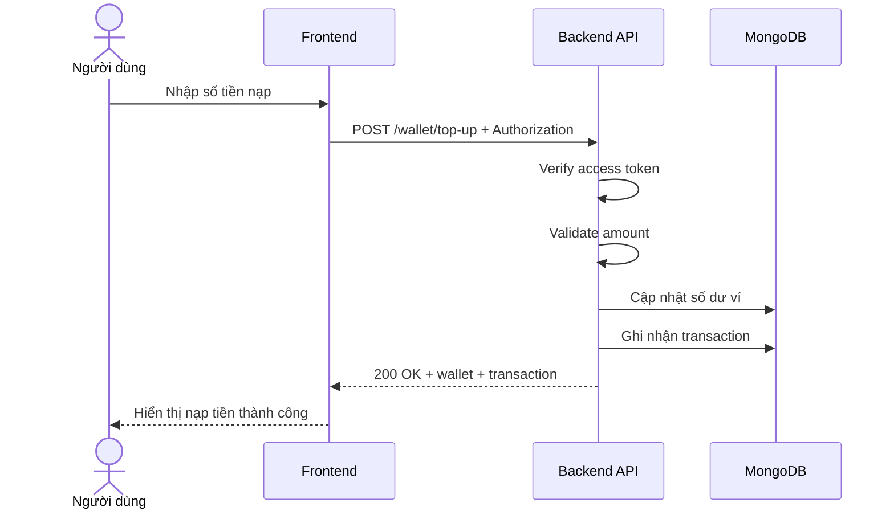

# Software Requirement Specification (SRS)
## Chức năng: Nạp tiền vào ví (Top Up Wallet)

### Mermaid Sequence Diagram

**Mã chức năng:** WALLET-TOPUP-01  
**Trạng thái:** Draft / Review  
**Người soạn thảo:** Nhữ Trung Hải  
**Vai trò:** Technical Writer / Developer

---

### 1. Mô tả tổng quan (Description)
Chức năng nạp tiền vào ví cho phép người dùng tăng số dư wallet trong hệ thống theo luồng top-up nội bộ hiện tại. API được triển khai tại `POST /wallet/top-up`.

### 2. Luồng nghiệp vụ (User Workflow)
| Bước | Hành động người dùng | Phản hồi hệ thống |
| :--- | :--- | :--- |
| 1 | Người dùng nhập số tiền cần nạp | Frontend gửi request top-up. |
| 2 | Backend xác thực và validate | Kiểm tra token và body request. |
| 3 | Backend cập nhật số dư | Tăng số dư ví và tạo transaction mới. |
| 4 | Hoàn tất | Trả kết quả cập nhật thành công. |

### 3. Yêu cầu dữ liệu (Data Requirements)
#### 3.1. Dữ liệu đầu vào (Input Fields)
* **Authorization:** bắt buộc.
* Body theo `topUpWalletValidator`.

#### 3.2. Dữ liệu đầu ra (Response Data)
* `status`
* `message`
* `data`: wallet và transaction liên quan

#### 3.3. Dữ liệu lưu trữ / truy xuất
* Wallet
* Wallet transactions

### 4. Ràng buộc kỹ thuật & bảo mật (Technical Constraints)
* Chỉ top-up cho ví của user hiện tại.

### 5. Trường hợp ngoại lệ & xử lý lỗi (Edge Cases)
* **Trường hợp:** Số tiền không hợp lệ.  
  * **Xử lý:** Trả `422 Unprocessable Entity`.

### 6. Giao diện (UI/UX)
* Nên hiển thị rõ số dư trước và sau khi nạp.

---
