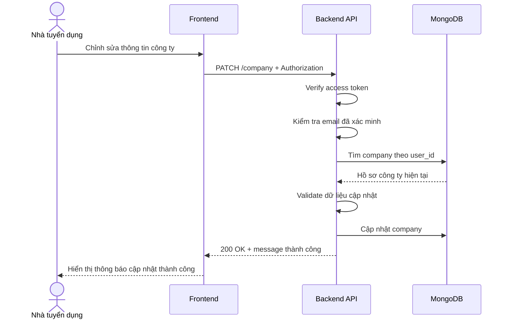

# Software Requirement Specification (SRS)
## Chức năng: Cập nhật hồ sơ công ty (Update Company)

### Mermaid Sequence Diagram

**Mã chức năng:** COMPANY-UPDATE-01  
**Trạng thái:** Draft / Review  
**Người soạn thảo:** Nguyễn Trọng An  
**Vai trò:** Technical Writer / Developer

---

### 1. Mô tả tổng quan (Description)
Chức năng cập nhật hồ sơ công ty cho phép nhà tuyển dụng đã có company profile thay đổi các thông tin doanh nghiệp như tên công ty, logo, website, địa chỉ và mô tả. API hiện tại được triển khai tại `PATCH /company`, chỉ cập nhật các trường được gửi lên.

### 2. Luồng nghiệp vụ (User Workflow)
| Bước | Hành động người dùng | Phản hồi hệ thống |
| :--- | :--- | :--- |
| 1 | Người dùng mở form chỉnh sửa hồ sơ công ty | Frontend hiển thị các trường thông tin hiện tại. |
| 2 | Người dùng thay đổi một hoặc nhiều trường | Frontend gửi `PATCH /company`. |
| 3 | Hệ thống xác thực người dùng | Middleware `isAuthorized` và `isVerified` kiểm tra quyền truy cập. |
| 4 | Hệ thống tải company hiện tại | `loadCompany` lấy hồ sơ công ty theo `user_id`. |
| 5 | Hệ thống kiểm tra company tồn tại | `requireCompany` xác nhận người dùng đã có hồ sơ công ty. |
| 6 | Hệ thống validate dữ liệu cập nhật | `updateCompanyValidator` kiểm tra URL, độ dài chuỗi và điều kiện phải có ít nhất một trường. |
| 7 | Hệ thống cập nhật database | Service cập nhật hồ sơ công ty và gắn `updated_at` mới. |
| 8 | Hoàn tất | Trả `200 OK` với thông báo cập nhật thành công. |

### 3. Yêu cầu dữ liệu (Data Requirements)
#### 3.1. Dữ liệu đầu vào (Input Fields)
* **Authorization:** `Bearer access token`, bắt buộc.
* **company_name:** `string`, tùy chọn, từ `2` đến `100` ký tự.
* **logo:** `string`, tùy chọn, phải là URL hợp lệ.
* **website:** `string`, tùy chọn, phải là URL hợp lệ.
* **address:** `string`, tùy chọn, từ `2` đến `100` ký tự.
* **description:** `string`, tùy chọn, tối đa `500` ký tự.

#### 3.2. Dữ liệu đầu ra (Response Data)
Khi thành công, hệ thống trả về:
* `status`: `success`
* `message`: `Cập nhật hồ sơ công ty thành công`

#### 3.3. Dữ liệu lưu trữ / truy xuất
* **JWT Access Token:** lấy `userId`.
* **Collection `companies`:** cập nhật document công ty hiện có theo `_id`.

### 4. Ràng buộc kỹ thuật & bảo mật (Technical Constraints)
* Chỉ người dùng đã đăng nhập, đã xác minh email và đã tạo company mới được gọi API.
* Validator dùng `refine` để bắt buộc body phải có ít nhất một trường cập nhật.
* Các trường chuỗi được `trim()` và `escape()` trước khi lưu.
* API hiện tại không trả lại toàn bộ dữ liệu company sau cập nhật, chỉ trả message.

### 5. Trường hợp ngoại lệ & xử lý lỗi (Edge Cases)
* **Trường hợp:** Không gửi access token.  
  * **Xử lý:** Trả `401 Unauthorized`.
* **Trường hợp:** Email chưa xác minh.  
  * **Xử lý:** Trả `401 Unauthorized`.
* **Trường hợp:** Người dùng chưa tạo hồ sơ công ty.  
  * **Xử lý:** Trả `404 Not Found`.
* **Trường hợp:** Body rỗng hoặc không có trường hợp lệ.  
  * **Xử lý:** Trả `422 Unprocessable Entity`.
* **Trường hợp:** `logo` hoặc `website` không phải URL hợp lệ.  
  * **Xử lý:** Trả `422 Unprocessable Entity`.
* **Trường hợp:** Lỗi khi cập nhật database.  
  * **Xử lý:** Trả `500 Internal Server Error`.

### 6. Giao diện (UI/UX)
* Form chỉnh sửa nên hỗ trợ prefill dữ liệu hiện tại từ API `GET /company/me`.
* Nên disable nút lưu khi người dùng chưa thay đổi dữ liệu.
* Sau khi cập nhật thành công, frontend nên gọi lại API xem hồ sơ công ty để làm mới dữ liệu hiển thị.

---

