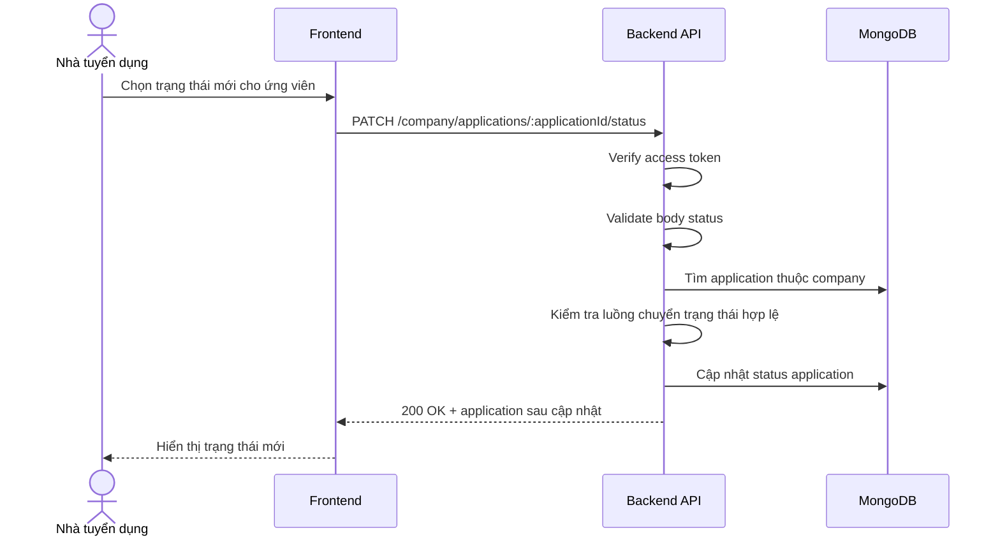

# Software Requirement Specification (SRS)
## Chức năng: Cập nhật trạng thái hồ sơ ứng tuyển của công ty (Update Company Application Status)

### Mermaid Sequence Diagram

**Mã chức năng:** COMPANY-APPLICATION-STATUS-01  
**Trạng thái:** Draft / Review  
**Người soạn thảo:** Nhữ Trung Hải  
**Vai trò:** Technical Writer / Developer

---

### 1. Mô tả tổng quan (Description)
Chức năng cập nhật trạng thái hồ sơ ứng tuyển cho phép nhà tuyển dụng đổi bước xử lý của một ứng viên như `reviewing`, `shortlisted`, `interviewing`, `rejected`, `hired`. API hiện tại được triển khai tại `PATCH /company/applications/:applicationId/status`.

### 2. Luồng nghiệp vụ (User Workflow)
| Bước | Hành động người dùng | Phản hồi hệ thống |
| :--- | :--- | :--- |
| 1 | Người dùng chọn trạng thái mới | Frontend gửi request cập nhật. |
| 2 | Backend validate dữ liệu | Kiểm tra `applicationId` và `status`. |
| 3 | Backend tải application | Xác nhận application thuộc company hiện tại. |
| 4 | Backend kiểm tra transition | Chỉ cho phép các bước chuyển hợp lệ. |
| 5 | Hoàn tất | Cập nhật trạng thái và trả dữ liệu mới. |

### 3. Yêu cầu dữ liệu (Data Requirements)
#### 3.1. Dữ liệu đầu vào (Input Fields)
* **Authorization:** bắt buộc.
* **applicationId:** Mongo ObjectId hợp lệ.
* **status:** trạng thái mới theo validator.

#### 3.2. Dữ liệu đầu ra (Response Data)
* `status`
* `message`
* `data`: application sau cập nhật

#### 3.3. Dữ liệu lưu trữ / truy xuất
* Collection `job applications`

### 4. Ràng buộc kỹ thuật & bảo mật (Technical Constraints)
* Chỉ company sở hữu hồ sơ mới được cập nhật.
* Có middleware kiểm tra chuyển trạng thái hợp lệ.

### 5. Trường hợp ngoại lệ & xử lý lỗi (Edge Cases)
* **Trường hợp:** Chuyển trạng thái không hợp lệ.  
  * **Xử lý:** Trả lỗi nghiệp vụ.
* **Trường hợp:** Application không tồn tại.  
  * **Xử lý:** Trả `404 Not Found`.

### 6. Giao diện (UI/UX)
* Frontend nên chỉ hiển thị các trạng thái được phép chọn tiếp theo.

---
