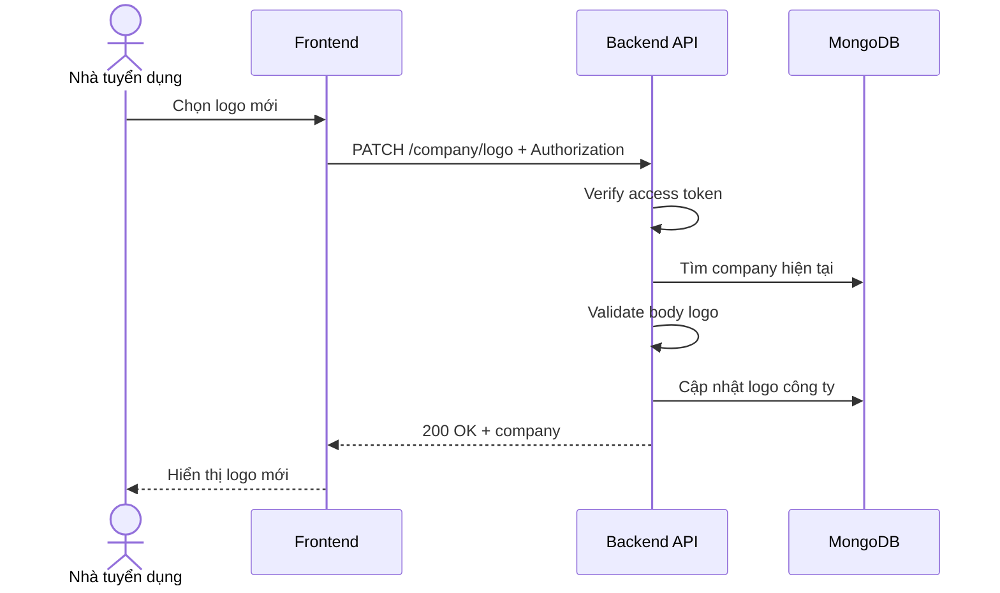

# Software Requirement Specification (SRS)
## Chức năng: Cập nhật logo công ty (Update Company Logo)

### Mermaid Sequence Diagram

**Mã chức năng:** COMPANY-LOGO-01  
**Trạng thái:** Draft / Review  
**Người soạn thảo:** Nhữ Trung Hải  
**Vai trò:** Technical Writer / Developer

---

### 1. Mô tả tổng quan (Description)
Chức năng cập nhật logo công ty cho phép nhà tuyển dụng thay đổi ảnh đại diện doanh nghiệp sau khi đã tạo hồ sơ công ty. API hiện tại được triển khai tại `PATCH /company/logo`.

### 2. Luồng nghiệp vụ (User Workflow)
| Bước | Hành động người dùng | Phản hồi hệ thống |
| :--- | :--- | :--- |
| 1 | Người dùng chọn logo mới | Frontend chuẩn bị URL/file key logo. |
| 2 | Frontend gọi API cập nhật | Gửi `PATCH /company/logo`. |
| 3 | Backend xác thực và tải company | Kiểm tra token, email verified và company hiện tại. |
| 4 | Backend validate dữ liệu logo | Kiểm tra body hợp lệ. |
| 5 | Hoàn tất | Cập nhật logo và trả thông tin mới. |

### 3. Yêu cầu dữ liệu (Data Requirements)
#### 3.1. Dữ liệu đầu vào (Input Fields)
* **Authorization:** bắt buộc.
* Trường logo theo `updateCompanyLogoValidator`.

#### 3.2. Dữ liệu đầu ra (Response Data)
* `status`
* `message`
* `data`: company sau cập nhật

#### 3.3. Dữ liệu lưu trữ / truy xuất
* Collection `companies`

### 4. Ràng buộc kỹ thuật & bảo mật (Technical Constraints)
* Chỉ chủ company hiện tại được cập nhật logo.

### 5. Trường hợp ngoại lệ & xử lý lỗi (Edge Cases)
* **Trường hợp:** Chưa có company profile.  
  * **Xử lý:** Trả `404 Not Found`.
* **Trường hợp:** Body không hợp lệ.  
  * **Xử lý:** Trả `422 Unprocessable Entity`.

### 6. Giao diện (UI/UX)
* Nên preview logo trước khi lưu.
* Sau khi cập nhật thành công, giao diện dashboard công ty cần refresh ảnh mới.

---
