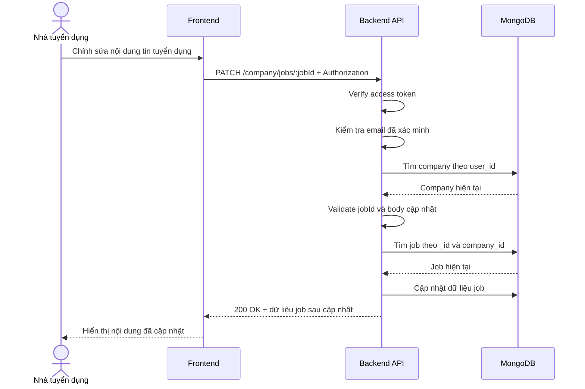

# Software Requirement Specification (SRS)
## Chức năng: Cập nhật tin tuyển dụng (Update Job)

### Mermaid Sequence Diagram

**Mã chức năng:** JOB-UPDATE-01  
**Trạng thái:** Draft / Review  
**Người soạn thảo:** Nhữ Trung Hải  
**Vai trò:** Technical Writer / Developer

---

### 1. Mô tả tổng quan (Description)
Chức năng cập nhật tin tuyển dụng cho phép nhà tuyển dụng thay đổi nội dung một job đã tạo, bao gồm mô tả, yêu cầu, quyền lợi, mức lương, địa điểm, cấp độ, kỹ năng, danh mục, số lượng và hạn nộp. API hiện tại được triển khai tại `PATCH /company/jobs/:jobId`.

### 2. Luồng nghiệp vụ (User Workflow)
| Bước | Hành động người dùng | Phản hồi hệ thống |
| :--- | :--- | :--- |
| 1 | Người dùng mở form chỉnh sửa job | Frontend hiển thị dữ liệu chi tiết hiện tại của job. |
| 2 | Người dùng cập nhật một hoặc nhiều trường | Frontend gửi `PATCH /company/jobs/:jobId`. |
| 3 | Hệ thống xác thực người dùng | `isAuthorized` và `isVerified` kiểm tra quyền truy cập. |
| 4 | Hệ thống kiểm tra company | `loadCompany` và `requireCompany` xác định công ty hiện tại. |
| 5 | Hệ thống validate tham số và body | Kiểm tra `jobId` hợp lệ và body phải có ít nhất một trường cập nhật. |
| 6 | Hệ thống kiểm tra quyền sở hữu job | Truy vấn job theo `_id` và `company_id`. |
| 7 | Hệ thống cập nhật job | Service ghi dữ liệu mới và gắn `updated_at` hiện tại. |
| 8 | Hoàn tất | Trả `200 OK` với dữ liệu job sau cập nhật. |

### 3. Yêu cầu dữ liệu (Data Requirements)
#### 3.1. Dữ liệu đầu vào (Input Fields)
* **Authorization:** `Bearer access token`, bắt buộc.
* **jobId:** `string`, bắt buộc, phải là ObjectId MongoDB hợp lệ.
* Các trường cập nhật đều là tùy chọn nhưng phải có ít nhất một trường:
  * `title`
  * `description`
  * `requirements`
  * `benefits`
  * `salary`
  * `location`
  * `job_type`
  * `level`
  * `category`
  * `skills`
  * `quantity`
  * `expired_at`

#### 3.2. Dữ liệu đầu ra (Response Data)
Khi thành công, hệ thống trả về:
* `status`: `success`
* `message`: `Cập nhật tin tuyển dụng thành công`
* `data._id`
* `data.title`
* `data.description`
* `data.requirements`
* `data.benefits`
* `data.salary`
* `data.location`
* `data.job_type`
* `data.level`
* `data.status`
* `data.category`
* `data.skills`
* `data.quantity`
* `data.expired_at`
* `data.published_at`
* `data.created_at`
* `data.updated_at`

#### 3.3. Dữ liệu lưu trữ / truy xuất
* **Collection `companies`:** xác định company hiện tại.
* **Collection `jobs`:** đọc job hiện tại, sau đó cập nhật document theo `_id`.

### 4. Ràng buộc kỹ thuật & bảo mật (Technical Constraints)
* API không dùng để đổi trạng thái job; trạng thái được xử lý ở route riêng `/company/jobs/:jobId/status`.
* Validator buộc body phải có ít nhất một trường cập nhật.
* `updated_at` luôn được backend cập nhật lại tại thời điểm sửa.
* Ràng buộc validate lương, số lượng, hạn nộp vẫn giữ nguyên như lúc tạo job.

### 5. Trường hợp ngoại lệ & xử lý lỗi (Edge Cases)
* **Trường hợp:** Không gửi access token hoặc email chưa xác minh.  
  * **Xử lý:** Trả `401 Unauthorized`.
* **Trường hợp:** Người dùng chưa có hồ sơ công ty.  
  * **Xử lý:** Trả `404 Not Found`.
* **Trường hợp:** `jobId` không hợp lệ.  
  * **Xử lý:** Trả `422 Unprocessable Entity`.
* **Trường hợp:** Body rỗng, không có trường cập nhật.  
  * **Xử lý:** Trả `422 Unprocessable Entity`.
* **Trường hợp:** Job không tồn tại hoặc không thuộc công ty hiện tại.  
  * **Xử lý:** Trả `404 Not Found`.
* **Trường hợp:** `expired_at` không hợp lệ hoặc đã ở quá khứ.  
  * **Xử lý:** Trả `422 Unprocessable Entity`.
* **Trường hợp:** Lỗi ghi database.  
  * **Xử lý:** Trả `500 Internal Server Error`.

### 6. Giao diện (UI/UX)
* Giao diện chỉnh sửa nên preload dữ liệu từ API chi tiết job.
* Có thể chia form thành các nhóm để người dùng cập nhật dễ hơn: mô tả, yêu cầu, quyền lợi, mức lương và metadata tuyển dụng.
* Sau khi cập nhật thành công, frontend nên hiển thị dữ liệu mới ngay và cho phép quay về danh sách job.

---

