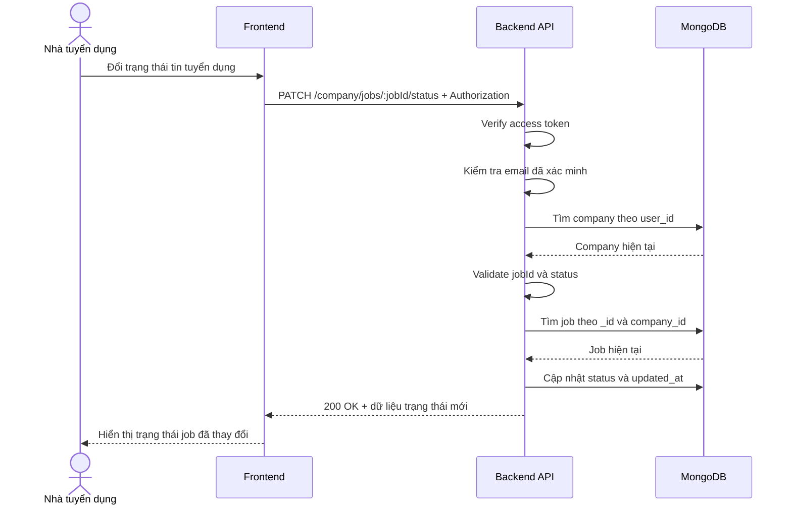

# Software Requirement Specification (SRS)
## Chức năng: Cập nhật trạng thái tin tuyển dụng (Update Job Status)

### Mermaid Sequence Diagram

**Mã chức năng:** JOB-STATUS-UPDATE-01  
**Trạng thái:** Draft / Review  
**Người soạn thảo:** Phạm Nguyễn Hưng  
**Vai trò:** Technical Writer / Developer

---

### 1. Mô tả tổng quan (Description)
Chức năng cập nhật trạng thái tin tuyển dụng cho phép nhà tuyển dụng thay đổi trạng thái vận hành của một job giữa các giá trị `draft`, `open`, `paused` và `closed`. API hiện tại được triển khai tại `PATCH /company/jobs/:jobId/status`. Nếu đổi sang `open` và job chưa từng có `published_at`, backend sẽ tự động sinh thời điểm mở tuyển.

### 2. Luồng nghiệp vụ (User Workflow)
| Bước | Hành động người dùng | Phản hồi hệ thống |
| :--- | :--- | :--- |
| 1 | Người dùng chọn thao tác đổi trạng thái job | Frontend hiển thị danh sách trạng thái hợp lệ. |
| 2 | Người dùng xác nhận trạng thái mới | Frontend gửi `PATCH /company/jobs/:jobId/status`. |
| 3 | Hệ thống xác thực phiên đăng nhập | `isAuthorized` và `isVerified` kiểm tra token và email. |
| 4 | Hệ thống kiểm tra company hiện tại | `loadCompany` và `requireCompany` xác nhận người dùng có company. |
| 5 | Hệ thống validate dữ liệu | Kiểm tra `jobId` hợp lệ và `status` thuộc tập cho phép. |
| 6 | Hệ thống kiểm tra quyền sở hữu job | Truy vấn job theo `_id` và `company_id`. |
| 7 | Hệ thống cập nhật trạng thái | Ghi `status`, `updated_at` và có thể gắn `published_at` nếu mở tuyển lần đầu. |
| 8 | Hoàn tất | Trả `200 OK` với trạng thái job mới. |

### 3. Yêu cầu dữ liệu (Data Requirements)
#### 3.1. Dữ liệu đầu vào (Input Fields)
* **Authorization:** `Bearer access token`, bắt buộc.
* **jobId:** `string`, bắt buộc, phải là ObjectId MongoDB hợp lệ.
* **status:** `draft | open | paused | closed`, bắt buộc.

#### 3.2. Dữ liệu đầu ra (Response Data)
Khi thành công, hệ thống trả về:
* `status`: `success`
* `message`: `Cập nhật trạng thái tin tuyển dụng thành công`
* `data._id`
* `data.title`
* `data.status`
* `data.published_at`
* `data.expired_at`
* `data.updated_at`

#### 3.3. Dữ liệu lưu trữ / truy xuất
* **Collection `companies`:** xác định công ty hiện tại.
* **Collection `jobs`:** cập nhật trạng thái trên document job tương ứng.

### 4. Ràng buộc kỹ thuật & bảo mật (Technical Constraints)
* Chỉ chấp nhận 4 trạng thái: `draft`, `open`, `paused`, `closed`.
* Trạng thái `expired` chỉ dùng ở tầng truy vấn/danh sách, không được set trực tiếp qua API này.
* Nếu đổi sang `open` khi `published_at` chưa tồn tại, backend sẽ tự gắn `published_at = new Date()`.
* API không thay đổi các trường nội dung khác ngoài `status`, `published_at`, `updated_at`.

### 5. Trường hợp ngoại lệ & xử lý lỗi (Edge Cases)
* **Trường hợp:** Không gửi access token hoặc email chưa xác minh.  
  * **Xử lý:** Trả `401 Unauthorized`.
* **Trường hợp:** Người dùng chưa có hồ sơ công ty.  
  * **Xử lý:** Trả `404 Not Found`.
* **Trường hợp:** `jobId` không hợp lệ.  
  * **Xử lý:** Trả `422 Unprocessable Entity`.
* **Trường hợp:** `status` không thuộc tập giá trị cho phép.  
  * **Xử lý:** Trả `422 Unprocessable Entity`.
* **Trường hợp:** Job không tồn tại hoặc không thuộc công ty hiện tại.  
  * **Xử lý:** Trả `404 Not Found`.
* **Trường hợp:** Lỗi ghi database.  
  * **Xử lý:** Trả `500 Internal Server Error`.

### 6. Giao diện (UI/UX)
* Frontend nên dùng dropdown hoặc action menu với danh sách trạng thái cố định.
* Khi chuyển sang `open`, có thể hiển thị thêm thời gian bắt đầu đăng tuyển dựa trên `published_at`.
* Sau khi cập nhật thành công, nên refresh lại danh sách job hoặc chi tiết job để đồng bộ trạng thái hiển thị.

---

