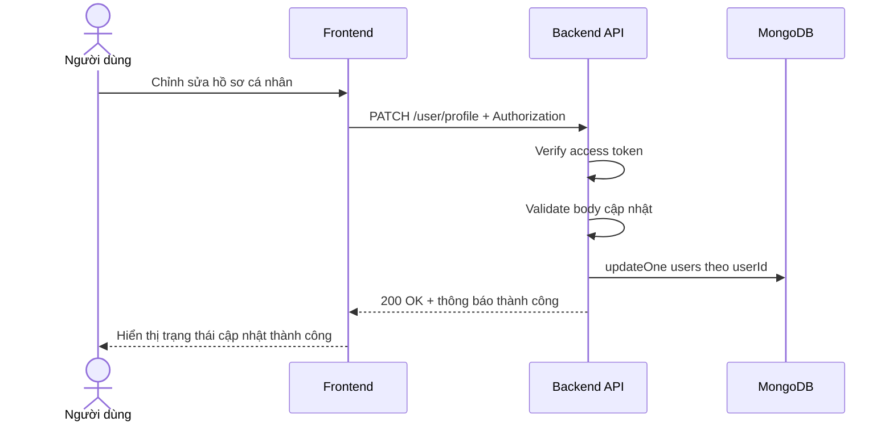

# Software Requirement Specification (SRS)
## Chức năng: Cập nhật hồ sơ cá nhân (Update Profile)

### Mermaid Sequence Diagram

**Mã chức năng:** USER-UPDATE-PROFILE-01  
**Trạng thái:** Draft / Review  
**Người soạn thảo:** Nhữ Trung Hải  
**Vai trò:** Technical Writer / Developer

---

### 1. Mô tả tổng quan (Description)
Chức năng cập nhật hồ sơ cá nhân cho phép người dùng đã đăng nhập chỉnh sửa thông tin hồ sơ của chính mình. API hiện tại được triển khai tại `PATCH /user/profile`. Hệ thống chỉ cho cập nhật các trường văn bản cơ bản như `fullName`, `bio`, `address`, `skills`.

### 2. Luồng nghiệp vụ (User Workflow)
| Bước | Hành động người dùng | Phản hồi hệ thống |
| :--- | :--- | :--- |
| 1 | Người dùng mở form chỉnh sửa hồ sơ | Frontend hiển thị các trường hồ sơ có thể cập nhật. |
| 2 | Người dùng nhập dữ liệu mới và lưu | Frontend gửi request `PATCH /user/profile`. |
| 3 | Hệ thống xác thực phiên đăng nhập | Middleware `isAuthorized` kiểm tra access token. |
| 4 | Hệ thống kiểm tra dữ liệu đầu vào | Validate các trường được phép cập nhật, đồng thời yêu cầu body không rỗng. |
| 5 | Hệ thống cập nhật database | Thực hiện `updateOne` theo `userId`. |
| 6 | Hoàn tất | Trả `200 OK` với thông báo cập nhật thành công. |

### 3. Yêu cầu dữ liệu (Data Requirements)
#### 3.1. Dữ liệu đầu vào (Input Fields)
Các trường đều là tùy chọn nhưng body phải có ít nhất một trường:
* **fullName:** `string`, tối thiểu `1`, tối đa `50` ký tự.
* **bio:** `string`, tối đa `300` ký tự.
* **address:** `string`, tối đa `100` ký tự.
* **skills:** `string[]`, mảng kỹ năng.

#### 3.2. Dữ liệu đầu ra (Response Data)
Khi thành công, hệ thống trả về:
* `status`: `success`
* `message`: `Cập nhật thông tin người dùng thành công`

#### 3.3. Dữ liệu lưu trữ / truy xuất
* **JWT Access Token:** lấy `userId` của người dùng hiện tại.
* **Collection `users`:** cập nhật các trường hồ sơ bằng `$set`.

### 4. Ràng buộc kỹ thuật & bảo mật (Technical Constraints)
* Route bắt buộc đăng nhập.
* Validate dùng `updateProfileUserValidator`.
* Các chuỗi đầu vào được `trim()` và `escape()` bằng `lodash.escape`.
* Body không được để trống; nếu không có trường nào thì validator sẽ từ chối.
* Source hiện tại chưa hỗ trợ upload `avatar`, `cover`, ảnh hồ sơ hoặc file đính kèm.

### 5. Trường hợp ngoại lệ & xử lý lỗi (Edge Cases)
* **Trường hợp:** Không gửi access token hoặc token không hợp lệ.  
  * **Xử lý:** Trả `401 Unauthorized`.
* **Trường hợp:** Body rỗng.  
  * **Xử lý:** Trả `422 Unprocessable Entity`.
* **Trường hợp:** `skills` không phải mảng hoặc một trường sai kiểu dữ liệu.  
  * **Xử lý:** Trả `422 Unprocessable Entity`.
* **Trường hợp:** Dữ liệu vượt giới hạn ký tự.  
  * **Xử lý:** Trả `422 Unprocessable Entity`.
* **Trường hợp:** Lỗi database khi cập nhật.  
  * **Xử lý:** Trả `500 Internal Server Error`.

### 6. Giao diện (UI/UX)
* Form nên cho phép chỉnh sửa riêng từng khối thông tin như họ tên, bio, kỹ năng.
* Frontend nên giữ lại dữ liệu cũ khi một request cập nhật bị lỗi validate.
* Sau khi lưu thành công, giao diện có thể gọi lại `GET /user/me` hoặc `GET /user/profile/:id` để làm mới dữ liệu hiển thị.

---
