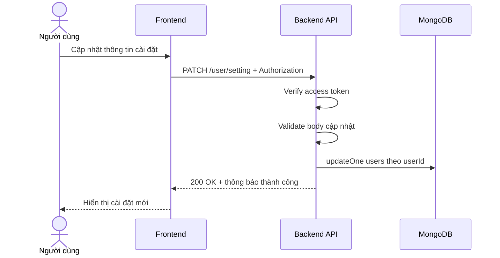

# Software Requirement Specification (SRS)
## Chức năng: Cập nhật cài đặt tài khoản (Update User Setting)

### Mermaid Sequence Diagram

**Mã chức năng:** USER-UPDATE-SETTING-01  
**Trạng thái:** Draft / Review  
**Người soạn thảo:** Nguyễn Trọng An  
**Vai trò:** Technical Writer / Developer

---

### 1. Mô tả tổng quan (Description)
Chức năng cập nhật cài đặt tài khoản cho phép người dùng chỉnh sửa thông tin cấu hình cơ bản của tài khoản. API hiện tại được triển khai tại `PATCH /user/setting`. Theo source hiện tại, trường duy nhất đang được hỗ trợ cập nhật là `phone`.

### 2. Luồng nghiệp vụ (User Workflow)
| Bước | Hành động người dùng | Phản hồi hệ thống |
| :--- | :--- | :--- |
| 1 | Người dùng sửa số điện thoại ở trang cài đặt | Frontend gửi request `PATCH /user/setting`. |
| 2 | Hệ thống xác thực phiên đăng nhập | Middleware `isAuthorized` kiểm tra access token. |
| 3 | Hệ thống validate dữ liệu đầu vào | Kiểm tra `phone` đúng định dạng số điện thoại Việt Nam và body không rỗng. |
| 4 | Hệ thống cập nhật dữ liệu | Gọi service cập nhật vào collection `users`. |
| 5 | Hoàn tất | Trả `200 OK` với thông báo cập nhật cài đặt thành công. |

### 3. Yêu cầu dữ liệu (Data Requirements)
#### 3.1. Dữ liệu đầu vào (Input Fields)
* **phone:** `string`, tùy chọn nhưng body phải không rỗng, đúng regex số điện thoại Việt Nam `^(0[3|5|7|8|9])([0-9]{8})$`.

#### 3.2. Dữ liệu đầu ra (Response Data)
Khi thành công, hệ thống trả về:
* `status`: `success`
* `message`: `Cập nhật cài đặt người dùng thành công`

#### 3.3. Dữ liệu lưu trữ / truy xuất
* **JWT Access Token:** lấy `userId`.
* **Collection `users`:** cập nhật dữ liệu bằng `$set`.

### 4. Ràng buộc kỹ thuật & bảo mật (Technical Constraints)
* Route bắt buộc đăng nhập.
* Validate dùng `updateSettingUserValidator`.
* Source hiện tại chỉ hỗ trợ trường `phone`, chưa hỗ trợ đổi email, username hoặc thiết lập bảo mật khác ở API này.
* Body rỗng bị từ chối bằng rule `refine(Object.keys(data).length > 0)`.

### 5. Trường hợp ngoại lệ & xử lý lỗi (Edge Cases)
* **Trường hợp:** Không gửi access token hoặc token không hợp lệ.  
  * **Xử lý:** Trả `401 Unauthorized`.
* **Trường hợp:** Không gửi trường nào trong body.  
  * **Xử lý:** Trả `422 Unprocessable Entity`.
* **Trường hợp:** `phone` sai định dạng Việt Nam.  
  * **Xử lý:** Trả `422 Unprocessable Entity`.
* **Trường hợp:** Lỗi database khi cập nhật.  
  * **Xử lý:** Trả `500 Internal Server Error`.

### 6. Giao diện (UI/UX)
* Form cài đặt hiện tại nên chỉ bật chỉnh sửa số điện thoại để tránh gửi thừa dữ liệu.
* Nên hiển thị rõ rule nhập số điện thoại Việt Nam.
* Sau khi cập nhật thành công, frontend có thể gọi lại `GET /user/setting` để đồng bộ dữ liệu.

---
