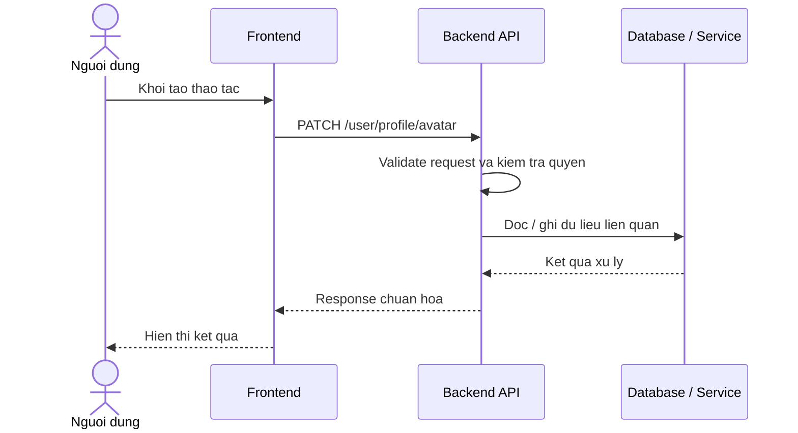

# Software Requirement Specification (SRS)
## Chuc nang: Cap nhat anh dai dien nguoi dung

### Mermaid Sequence Diagram

**Ma chuc nang:** USER-AVATAR-01  
**Trang thai:** Draft / Review  
**Nguoi soan thao:** Nhu Trung Hai  
**Vai tro:** Technical Writer / Developer

---

### 1. Mo ta tong quan (Description)
Chuc nang cho phep nguoi dung thay doi avatar ho so ca nhan sau khi da dang nhap. API hien tai duoc trien khai tai `PATCH /user/profile/avatar`.

### 2. Luong nghiep vu (User Workflow)
| Buoc | Hanh dong nguoi dung | Phan hoi he thong |
| :--- | :--- | :--- |
| 1 | Nguoi dung / quan tri vien mo chuc nang tuong ung | Frontend chuan bi du lieu va goi API. |
| 2 | Frontend gui request den backend | Backend kiem tra du lieu dau vao, token, quyen va ngu canh nghiep vu. |
| 3 | Backend xu ly nghiep vu | He thong doc / ghi du lieu tai MongoDB hoac dich vu phu tro. |
| 4 | Hoan tat | Backend tra response dang `status`, `message`, `data` de frontend cap nhat giao dien. |

### 3. Yeu cau du lieu (Data Requirements)
#### 3.1. Du lieu dau vao (Input Fields)
* Header `Authorization: Bearer <token>` hop le.
* Body chua thong tin avatar moi theo validator hien tai.

#### 3.2. Du lieu dau ra (Response Data)
* `status: success`
* `message`: cap nhat avatar thanh cong.

#### 3.3. Du lieu luu tru / truy xuat
* Collection `users` de cap nhat truong avatar cua nguoi dung.

### 4. Rang buoc ky thuat & bao mat (Technical Constraints)
* Chi nguoi dung da dang nhap moi thao tac duoc.
* Du lieu avatar phai qua validator backend truoc khi ghi DB.

### 5. Truong hop ngoai le & xu ly loi (Edge Cases)
* **Truong hop:** Avatar payload khong hop le.  
  * **Xu ly:** Tra `422 Unprocessable Entity`.
* **Truong hop:** Token het han hoac khong hop le.  
  * **Xu ly:** Tra `401 Unauthorized`.

### 6. Giao dien (UI/UX)
* Man hinh ho so can co nut doi avatar va preview anh moi.
* Sau khi luu thanh cong nen cap nhat avatar ngay tren header / sidebar.

---
