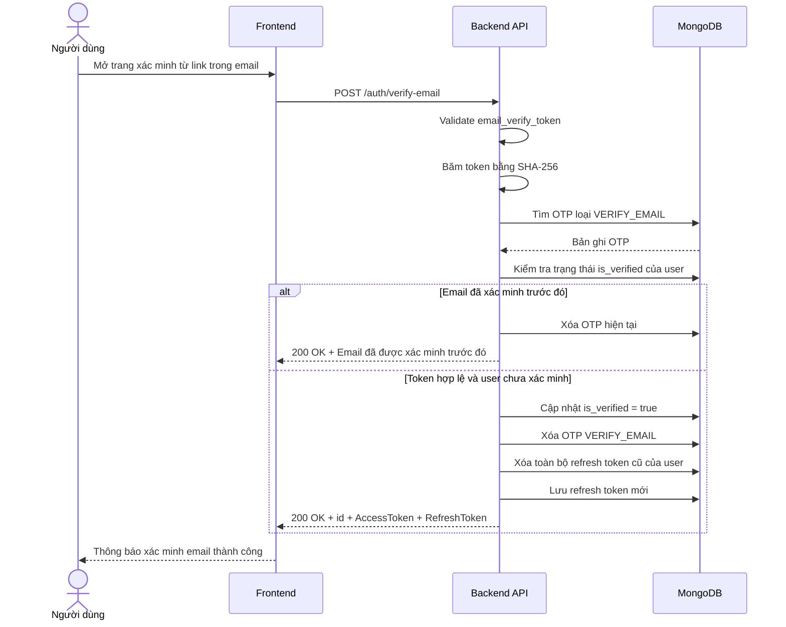

# Software Requirement Specification (SRS)
## Chức năng: Xác minh email tài khoản (Verify Email)

### Mermaid Sequence Diagram

**Mã chức năng:** AUTH-VERIFY-EMAIL-01  
**Trạng thái:** Draft / Review  
**Người soạn thảo:** Nguyễn Trọng An
**Vai trò:** Technical Writer / Developer

---

### 1. Mô tả tổng quan (Description)
Chức năng xác minh email cho phép người dùng kích hoạt trạng thái email đã xác thực sau khi đăng ký tài khoản hoặc sau khi nhận lại email xác minh. API hiện tại được triển khai tại `POST /auth/verify-email`. Hệ thống nhận `email_verify_token`, băm token trước khi tra cứu trong collection OTP, kiểm tra hạn sử dụng và sau đó cập nhật `is_verified = true` cho người dùng. Khi xác minh thành công, hệ thống xóa toàn bộ refresh token cũ và cấp lại cặp token đăng nhập mới với cờ xác minh đã bật.

### 2. Luồng nghiệp vụ (User Workflow)
| Bước | Hành động người dùng | Phản hồi hệ thống |
| :--- | :--- | :--- |
| 1 | Người dùng mở link xác minh từ email | Frontend điều hướng đến màn hình xác minh email. |
| 2 | Frontend gửi request xác minh | Gọi `POST /auth/verify-email` với `email_verify_token`. |
| 3 | Hệ thống kiểm tra dữ liệu đầu vào | Validate token bằng `zod` và băm token bằng `sha256` trước khi tra cứu. |
| 4 | Hệ thống kiểm tra OTP xác minh | Tìm bản ghi trong `otpCodes` với `type = VERIFY_EMAIL`, đồng thời kiểm tra token còn hạn hay không. |
| 5 | Hệ thống kiểm tra trạng thái tài khoản | Nếu user đã xác minh trước đó thì xóa OTP hiện tại và trả thông báo thành công đặc biệt. |
| 6 | Hệ thống xác minh email thành công | Cập nhật `is_verified = true`, xóa OTP xác minh, xóa các refresh token cũ và sinh `AccessToken`, `RefreshToken` mới. |
| 7 | Hoàn tất | Trả `200 OK` cùng thông báo xác minh email thành công và dữ liệu token mới. |

### 3. Yêu cầu dữ liệu (Data Requirements)
#### 3.1. Dữ liệu đầu vào (Input Fields)
* **email_verify_token:** `string`, bắt buộc, được gửi trong body request.

#### 3.2. Dữ liệu đầu ra (Response Data)
Khi xác minh email thành công, hệ thống trả về:
* `status`: `success`
* `message`: `Xác minh email thành công`
* `data.id`: ID người dùng
* `data.AccessToken`: JWT access token mới
* `data.RefreshToken`: JWT refresh token mới

Trong trường hợp email đã được xác minh trước đó, hệ thống trả:
* `status`: `success`
* `message`: `Email đã được xác minh trước đó`

#### 3.3. Dữ liệu lưu trữ / truy xuất
* **Collection `otpCodes`:** tra cứu và xóa mã xác minh email với `type = VERIFY_EMAIL`.
* **Collection `users`:** cập nhật `is_verified = true`, `updated_at`.
* **Collection `refreshTokens`:** xóa toàn bộ refresh token cũ của người dùng và tạo refresh token mới cho phiên sau xác minh.

### 4. Ràng buộc kỹ thuật & bảo mật (Technical Constraints)
* Request được validate bằng `zod` qua `verifyEmailValidator`.
* Token xác minh email không được tra cứu trực tiếp dạng thô; middleware băm token bằng `hashToken()` trước khi truy vấn database.
* Chỉ OTP có `type = VERIFY_EMAIL` và còn hạn sử dụng mới được chấp nhận.
* Nếu user đã có `is_verified = true`, middleware trả thành công sớm và không cấp lại token mới.
* Khi xác minh thành công, service xóa toàn bộ refresh token cũ của user rồi sinh cặp token mới với `vfd = true`.
* `device_info` của refresh token mới được suy ra từ `User-Agent` bằng `ua-parser-js`.
* Thời gian sống của email verify token được cấu hình bằng biến môi trường `ExpiresIn_EMAIL_VERIFY_TOKEN` ở thời điểm token được tạo từ luồng đăng ký hoặc gửi lại email xác minh.

### 5. Trường hợp ngoại lệ & xử lý lỗi (Edge Cases)
* **Trường hợp:** Không gửi `email_verify_token`.  
  * **Xử lý:** Trả `422 Unprocessable Entity`.
* **Trường hợp:** `email_verify_token` không hợp lệ hoặc đã hết hạn.  
  * **Xử lý:** Trả `401 Unauthorized` với thông báo token xác minh không hợp lệ hoặc đã hết hạn.
* **Trường hợp:** Email đã được xác minh trước đó.  
  * **Xử lý:** Trả `200 OK` với thông báo `Email đã được xác minh trước đó`, đồng thời xóa OTP verify hiện tại.
* **Trường hợp:** OTP tồn tại nhưng người dùng tương ứng không còn trong hệ thống.  
  * **Xử lý:** Service trả `401 Unauthorized` với thông báo người dùng không tồn tại.
* **Trường hợp:** Body JSON lỗi cú pháp.  
  * **Xử lý:** Trả `400 Bad Request`.
* **Trường hợp:** Lỗi database khi cập nhật user, xóa OTP hoặc cấp lại refresh token.  
  * **Xử lý:** Trả `500 Internal Server Error`.

### 6. Giao diện (UI/UX)
* Trang xác minh email nên tự động đọc token từ URL rồi gọi `POST /auth/verify-email`.
* Frontend cần xử lý hai phản hồi thành công khác nhau: `Xác minh email thành công` và `Email đã được xác minh trước đó`.
* Sau khi xác minh thành công và nhận token mới, frontend nên cập nhật lại trạng thái đăng nhập theo cặp token mới được cấp.
* Nếu token không hợp lệ hoặc đã hết hạn, giao diện nên hướng người dùng tới thao tác gửi lại email xác minh.

---
