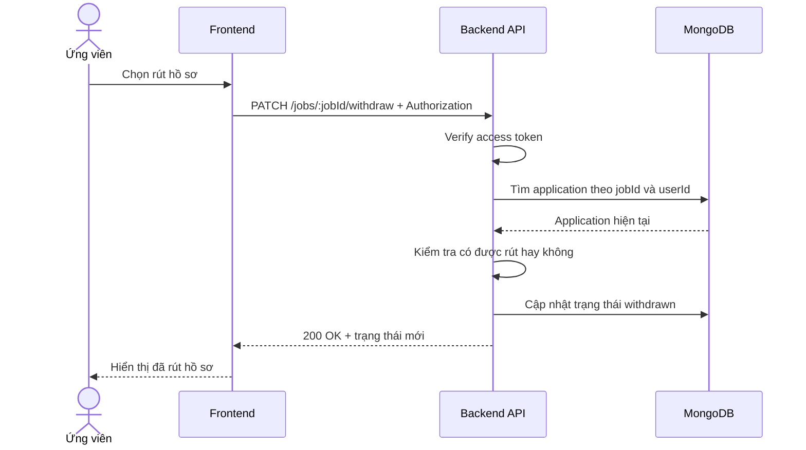

# Software Requirement Specification (SRS)
## Chức năng: Rút hồ sơ ứng tuyển (Withdraw Job Application)

### Mermaid Sequence Diagram

**Mã chức năng:** JOB-WITHDRAW-01  
**Trạng thái:** Draft / Review  
**Người soạn thảo:** Nguyễn Trọng An  
**Vai trò:** Technical Writer / Developer

---

### 1. Mô tả tổng quan (Description)
Chức năng rút hồ sơ ứng tuyển cho phép ứng viên hủy một hồ sơ đã nộp trước đó nếu hồ sơ còn ở trạng thái cho phép rút. API hiện tại được triển khai tại `PATCH /jobs/:jobId/withdraw`.

### 2. Luồng nghiệp vụ (User Workflow)
| Bước | Hành động người dùng | Phản hồi hệ thống |
| :--- | :--- | :--- |
| 1 | Người dùng mở danh sách job đã ứng tuyển | Frontend hiển thị nút rút hồ sơ khi hợp lệ. |
| 2 | Người dùng xác nhận rút | Frontend gọi `PATCH /jobs/:jobId/withdraw`. |
| 3 | Backend xác thực người dùng | Kiểm tra access token. |
| 4 | Backend tải application của user | Tìm theo `jobId` và user hiện tại. |
| 5 | Backend kiểm tra trạng thái | Chỉ cho rút ở các trạng thái hợp lệ. |
| 6 | Hoàn tất | Cập nhật trạng thái `withdrawn` và trả kết quả. |

### 3. Yêu cầu dữ liệu (Data Requirements)
#### 3.1. Dữ liệu đầu vào (Input Fields)
* **Authorization:** bắt buộc.
* **jobId:** Mongo ObjectId hợp lệ.

#### 3.2. Dữ liệu đầu ra (Response Data)
* `status`: `success`
* `message`: thông báo rút hồ sơ thành công
* `data`: thông tin application sau cập nhật

#### 3.3. Dữ liệu lưu trữ / truy xuất
* Collection `job applications`

### 4. Ràng buộc kỹ thuật & bảo mật (Technical Constraints)
* Route bắt buộc đăng nhập.
* Có middleware `ensureCanWithdrawApplication` để kiểm tra điều kiện rút hồ sơ.

### 5. Trường hợp ngoại lệ & xử lý lỗi (Edge Cases)
* **Trường hợp:** Hồ sơ không tồn tại.  
  * **Xử lý:** Trả `404 Not Found`.
* **Trường hợp:** Hồ sơ đã ở trạng thái kết thúc.  
  * **Xử lý:** Trả lỗi nghiệp vụ, không cho rút.
* **Trường hợp:** `jobId` không hợp lệ.  
  * **Xử lý:** Trả `422 Unprocessable Entity`.

### 6. Giao diện (UI/UX)
* Nút rút hồ sơ chỉ nên hiện khi backend còn cho phép.
* Sau khi rút thành công, giao diện cần đổi trạng thái ngay.

---
